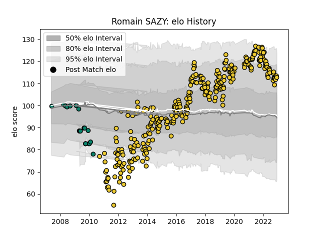

---  
layout: page  
title: Romain SAZY  
date: 2023-01-17 11:46:09.515251  
categories: player  
---
# Romain SAZY

## Positions: L, FL

## Current elo: 134.0

## Current Percentile: 97.0

# Elo History

# Match History

| Team        |   Appearances |   Win Rate |
|:------------|--------------:|-----------:|
| La Rochelle |           310 |   0.580645 |
| Montauban   |            20 |   0.15     |

| Opponent             |   Matches |   Win Rate |
|:---------------------|----------:|-----------:|
| Racing 92            |        19 |   0.473684 |
| Stade Toulousain     |        19 |   0.315789 |
| Toulon               |        19 |   0.5      |
| Clermont Auvergne    |        18 |   0.25     |
| Castres Olympique    |        17 |   0.529412 |
| Stade Francais Paris |        17 |   0.5      |
| Pau                  |        16 |   0.75     |
| Brive                |        15 |   0.6      |
| Bordeaux Begles      |        14 |   0.5      |
| Agen                 |        13 |   0.615385 |
| Lyon                 |        13 |   0.730769 |
| Montpellier Herault  |        11 |   0.545455 |
| Bayonne              |        11 |   0.5      |
| Grenoble             |         9 |   0.666667 |
| Perpignan            |         8 |   0.625    |
| Oyonnax              |         7 |   0.285714 |
| Dax                  |         7 |   0.428571 |
| Narbonne             |         6 |   0.5      |
| Albi                 |         6 |   0.833333 |
| Aurillac             |         6 |   0.666667 |
| Auch                 |         6 |   1        |
| Bourgoin-Jallieu     |         6 |   0.583333 |
| Gloucester Rugby     |         5 |   0.2      |
| Beziers              |         5 |   1        |
| Carcassonne          |         5 |   0.6      |
| Tarbes               |         5 |   0.4      |
| Biarritz Olympique   |         5 |   0.2      |
| Provence Rugby       |         4 |   0.75     |
| Zebre                |         4 |   0.75     |
| Colomiers            |         4 |   1        |
| Mont-de-Marsan       |         3 |   0.666667 |
| Ulster               |         3 |   1        |
| Bristol Rugby        |         3 |   0.666667 |
| Massy                |         2 |   1        |
| Worcester Warriors   |         2 |   0.5      |
| Périgueux            |         2 |   0.5      |
| Wasps                |         2 |   0.5      |
| Exeter Chiefs        |         2 |   0        |
| Sale Sharks          |         2 |   0.5      |
| US Bressane          |         2 |   1        |
| Benetton Treviso     |         1 |   1        |
| Northampton Saints   |         1 |   1        |
| Newcastle Falcons    |         1 |   0        |
| Scarlets             |         1 |   0        |
| RC Enisei            |         1 |   1        |
| Harlequins           |         1 |   1        |
| Edinburgh            |         1 |   1        |