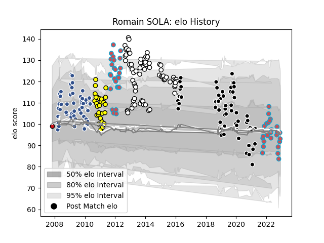

---  
layout: page  
title: Romain SOLA  
date: 2023-02-02 15:49:55.366500  
categories: player  
---
# Romain SOLA

## Positions: FH, FB

## Current elo: 87.0

## Current Percentile: 30.0

# Elo History

# Match History

| Team             |   Appearances |   Win Rate |
|:-----------------|--------------:|-----------:|
| Brive            |            71 |   0.542254 |
| Provence Rugby   |            62 |   0.443548 |
| Bourgoin-Jallieu |            56 |   0.535714 |
| Agen             |            54 |   0.675926 |
| Albi             |            26 |   0.673077 |
| Stade Toulousain |             1 |   1        |

| Opponent                   |   Matches |   Win Rate |
|:---------------------------|----------:|-----------:|
| Oyonnax                    |        16 |   0.3125   |
| Narbonne                   |        13 |   0.615385 |
| Dax                        |        13 |   0.461538 |
| Mont-de-Marsan             |        12 |   0.541667 |
| Colomiers                  |        11 |   0.636364 |
| Aurillac                   |        11 |   0.772727 |
| Tarbes                     |        10 |   0.7      |
| Pau                        |        10 |   0.55     |
| Beziers                    |        10 |   0.6      |
| Lyon                       |         9 |   0.555556 |
| La Rochelle                |         9 |   0.444444 |
| Grenoble                   |         9 |   0.5      |
| Bordeaux Begles            |         8 |   0.5      |
| Provence Rugby             |         7 |   0.857143 |
| Albi                       |         7 |   0.571429 |
| Carcassonne                |         7 |   0.571429 |
| Biarritz Olympique         |         6 |   0        |
| Auch                       |         6 |   0.916667 |
| Racing 92                  |         5 |   0.6      |
| Vannes                     |         5 |   0.6      |
| Nevers                     |         5 |   0.6      |
| Nice                       |         4 |   0.75     |
| Perpignan                  |         4 |   0.25     |
| Bayonne                    |         4 |   0.5      |
| Newcastle Falcons          |         4 |   0.75     |
| Massy                      |         4 |   0.25     |
| Montauban                  |         3 |   0.333333 |
| Soyaux-Angouleme           |         3 |   0        |
| Stade Francais Paris       |         3 |   0.666667 |
| Castres Olympique          |         3 |   0.333333 |
| Montpellier Herault        |         3 |   0.666667 |
| Stade Toulousain           |         3 |   0.333333 |
| Suresnes                   |         3 |   0.333333 |
| US Bressane                |         3 |   0.666667 |
| Cognac Saint Jean d'Angély |         3 |   1        |
| Saint-Etienne              |         2 |   1        |
| Blagnac                    |         2 |   0.5      |
| Bucuresti                  |         2 |   1        |
| Calvisano                  |         2 |   0.75     |
| Connacht                   |         2 |   0.5      |
| Périgueux                  |         2 |   1        |
| RC Enisei                  |         2 |   0.5      |
| Clermont Auvergne          |         2 |   0        |
| Chambery                   |         2 |   1        |
| Rouen                      |         2 |   0.75     |
| Toulon                     |         1 |   0        |
| Valence Romans Drome Rugby |         1 |   1        |
| Carqueiranne-Hyères        |         1 |   1        |
| Roval Drome XV             |         1 |   1        |
| Rennes                     |         1 |   1        |
| Bath Rugby                 |         1 |   0        |
| Bourgoin-Jallieu           |         1 |   1        |
| Aubenas                    |         1 |   1        |
| Limoges                    |         1 |   0.5      |
| Lannemezan                 |         1 |   1        |
| Brive                      |         1 |   0        |
| Gloucester Rugby           |         1 |   0        |
| Dijon                      |         1 |   1        |
| Zebre                      |         1 |   0        |