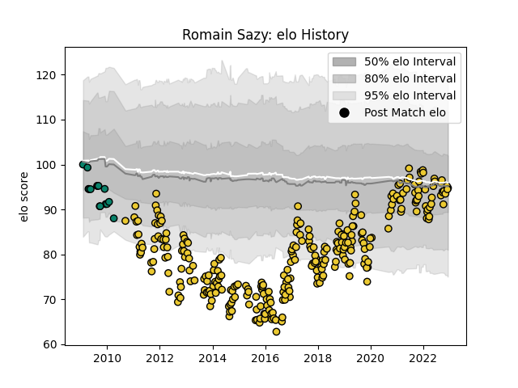

---  
layout: page  
title: Romain Sazy  
date: 2022-12-18 16:22:35.163622  
categories: player  
---
# Romain Sazy

## Positions: L, FL

## Current elo: 99.0

## Current Percentile: 45.0

# Elo History

# Match History

| Team        |   Appearances |   Win Rate |
|:------------|--------------:|-----------:|
| La Rochelle |           294 |   0.57483  |
| Montauban   |            15 |   0.133333 |

| Opponent             |   Matches |   Win Rate |
|:---------------------|----------:|-----------:|
| Toulon               |        19 |   0.5      |
| Racing 92            |        19 |   0.473684 |
| Stade Toulousain     |        18 |   0.277778 |
| Clermont Auvergne    |        18 |   0.25     |
| Stade Francais Paris |        17 |   0.5      |
| Pau                  |        15 |   0.8      |
| Brive                |        15 |   0.6      |
| Castres Olympique    |        15 |   0.6      |
| Agen                 |        13 |   0.615385 |
| Lyon                 |        13 |   0.730769 |
| Bordeaux Begles      |        13 |   0.538462 |
| Montpellier Herault  |        11 |   0.545455 |
| Bayonne              |        10 |   0.55     |
| Grenoble             |         9 |   0.666667 |
| Perpignan            |         7 |   0.571429 |
| Narbonne             |         6 |   0.5      |
| Dax                  |         5 |   0.4      |
| Bourgoin-Jallieu     |         5 |   0.5      |
| Biarritz Olympique   |         5 |   0.2      |
| Gloucester Rugby     |         5 |   0.2      |
| Beziers              |         5 |   1        |
| Aurillac             |         5 |   0.6      |
| Auch                 |         5 |   1        |
| Oyonnax              |         5 |   0.4      |
| Carcassonne          |         5 |   0.6      |
| Zebre                |         4 |   0.75     |
| Colomiers            |         4 |   1        |
| Albi                 |         4 |   1        |
| Mont-de-Marsan       |         3 |   0.666667 |
| Provence Rugby       |         3 |   0.666667 |
| Tarbes               |         3 |   0        |
| Bristol Rugby        |         3 |   0.666667 |
| Worcester Warriors   |         2 |   0.5      |
| Wasps                |         2 |   0.5      |
| Ulster               |         2 |   1        |
| Sale Sharks          |         2 |   0.5      |
| Périgueux            |         2 |   0.5      |
| Exeter Chiefs        |         2 |   0        |
| Massy                |         2 |   1        |
| Newcastle Falcons    |         1 |   0        |
| Scarlets             |         1 |   0        |
| Edinburgh            |         1 |   1        |
| RC Enisei            |         1 |   1        |
| Benetton Treviso     |         1 |   1        |
| US Bressane          |         1 |   1        |
| Harlequins           |         1 |   1        |
| Northampton Saints   |         1 |   1        |