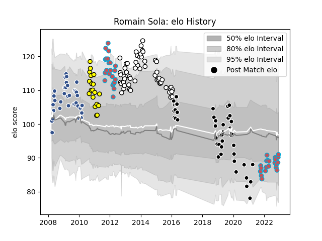

---  
layout: page  
title: Romain Sola  
date: 2022-11-22 11:35:42.223827  
categories: player  
---
# Romain Sola

## Positions: FH, FB

## Current elo: 88.0

## Current Percentile: 15.0

# Elo History

# Match History

| Team             |   Appearances |   Win Rate |
|:-----------------|--------------:|-----------:|
| Brive            |            56 |   0.544643 |
| Provence Rugby   |            43 |   0.395349 |
| Bourgoin-Jallieu |            41 |   0.560976 |
| Agen             |            37 |   0.702703 |
| Albi             |            19 |   0.763158 |

| Opponent                   |   Matches |   Win Rate |
|:---------------------------|----------:|-----------:|
| Oyonnax                    |        13 |   0.384615 |
| Mont-de-Marsan             |        11 |   0.5      |
| Dax                        |        10 |   0.5      |
| Narbonne                   |         9 |   0.666667 |
| Bordeaux Begles            |         8 |   0.5      |
| Colomiers                  |         8 |   0.75     |
| Tarbes                     |         7 |   0.714286 |
| Beziers                    |         7 |   0.571429 |
| Albi                       |         6 |   0.5      |
| Carcassonne                |         6 |   0.5      |
| Pau                        |         6 |   0.75     |
| Auch                       |         6 |   0.916667 |
| La Rochelle                |         6 |   0.5      |
| Lyon                       |         6 |   0.5      |
| Aurillac                   |         6 |   0.75     |
| Vannes                     |         5 |   0.6      |
| Provence Rugby             |         5 |   0.8      |
| Grenoble                   |         5 |   0.7      |
| Newcastle Falcons          |         4 |   0.75     |
| Nevers                     |         4 |   0.5      |
| Massy                      |         4 |   0.25     |
| Racing 92                  |         4 |   0.75     |
| Biarritz Olympique         |         4 |   0        |
| Stade Francais Paris       |         3 |   0.666667 |
| Perpignan                  |         3 |   0.333333 |
| Bayonne                    |         3 |   0.333333 |
| Nice                       |         3 |   0.666667 |
| Saint-Etienne              |         2 |   1        |
| Chambery                   |         2 |   1        |
| Stade Toulousain           |         2 |   0        |
| Montauban                  |         2 |   0        |
| Suresnes                   |         2 |   0.5      |
| Bucuresti                  |         2 |   1        |
| Connacht                   |         2 |   0.5      |
| Calvisano                  |         2 |   0.75     |
| Cognac Saint Jean d'Angély |         2 |   1        |
| RC Enisei                  |         2 |   0.5      |
| Toulon                     |         1 |   0        |
| US Bressane                |         1 |   1        |
| Soyaux-Angouleme           |         1 |   0        |
| Castres Olympique          |         1 |   0        |
| Périgueux                  |         1 |   1        |
| Bath Rugby                 |         1 |   0        |
| Montpellier Herault        |         1 |   1        |
| Blagnac                    |         1 |   1        |
| Bourgoin-Jallieu           |         1 |   1        |
| Lannemezan                 |         1 |   1        |
| Brive                      |         1 |   0        |
| Gloucester Rugby           |         1 |   0        |
| Clermont Auvergne          |         1 |   0        |
| Zebre                      |         1 |   0        |