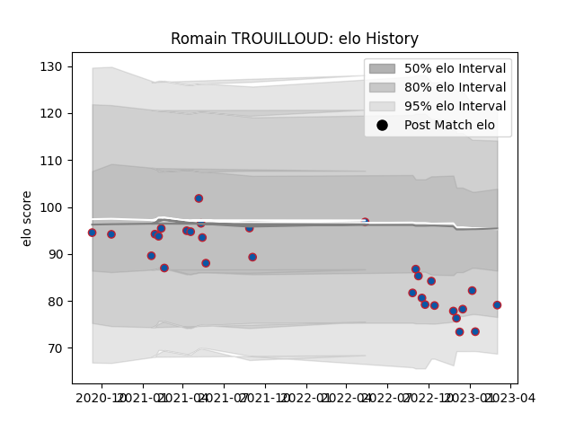

---  
layout: page  
title: Romain TROUILLOUD  
date: 2023-03-11 00:14:45.147285  
categories: player  
---
# Romain TROUILLOUD

## Positions: C

## Current elo: 74.0

## Current Percentile: 9.0

# Elo History

# Match History

| Team     |   Appearances |   Win Rate |
|:---------|--------------:|-----------:|
| Grenoble |            31 |   0.564516 |

| Opponent                   |   Matches |   Win Rate |
|:---------------------------|----------:|-----------:|
| Aurillac                   |         4 |      0.75  |
| Provence Rugby             |         4 |      0.375 |
| Vannes                     |         4 |      0.5   |
| Beziers                    |         2 |      1     |
| Biarritz Olympique         |         2 |      0.25  |
| Carcassonne                |         2 |      0.75  |
| Montauban                  |         2 |      0.5   |
| Oyonnax                    |         2 |      0     |
| Rouen                      |         2 |      0.5   |
| Agen                       |         1 |      1     |
| Colomiers                  |         1 |      0     |
| Massy                      |         1 |      1     |
| Mont-de-Marsan             |         1 |      0     |
| Nevers                     |         1 |      1     |
| US Bressane                |         1 |      1     |
| Valence Romans Drome Rugby |         1 |      1     |