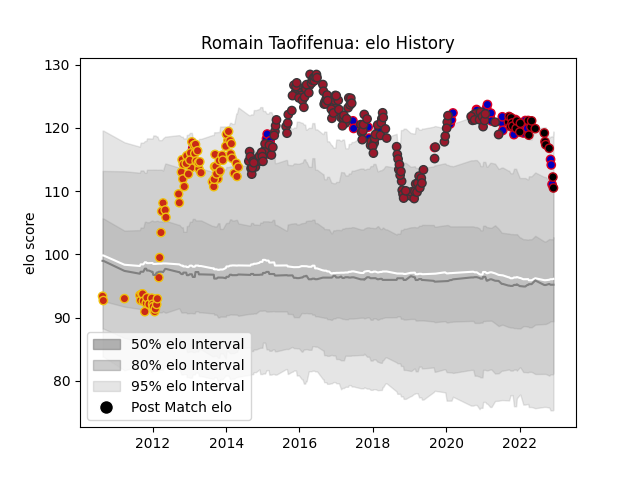

---  
layout: page  
title: Romain Taofifenua  
date: 2023-03-21 18:05:51.128118  
categories: player  
---
# Romain Taofifenua

Last updated: 2023-03-21
## Positions: L

## Country: France

## Current elo: 95.0

## Current Percentile: 81.0

# Elo History

# Match History

| Team      |   Appearances |   Win Rate |
|:----------|--------------:|-----------:|
| Toulon    |           154 |   0.555195 |
| Perpignan |            82 |   0.493902 |
| France    |            43 |   0.616279 |
| Lyon      |            33 |   0.575758 |

| Opponent             |   Matches |   Win Rate |
|:---------------------|----------:|-----------:|
| Clermont Auvergne    |        20 |   0.5      |
| Montpellier Herault  |        20 |   0.5      |
| Racing 92            |        19 |   0.315789 |
| Stade Toulousain     |        17 |   0.588235 |
| Bordeaux Begles      |        16 |   0.5625   |
| Stade Francais Paris |        16 |   0.4375   |
| Brive                |        15 |   0.466667 |
| La Rochelle          |        14 |   0.392857 |
| Castres Olympique    |        14 |   0.571429 |
| Bayonne              |        11 |   0.545455 |
| Pau                  |        11 |   0.727273 |
| Agen                 |        10 |   0.5      |
| Toulon               |         8 |   0.1875   |
| Italy                |         8 |   0.875    |
| Grenoble             |         7 |   0.642857 |
| Scarlets             |         7 |   0.714286 |
| Oyonnax              |         6 |   0.666667 |
| Scotland             |         6 |   0.5      |
| Wales                |         6 |   0.666667 |
| Lyon                 |         6 |   0.583333 |
| Biarritz Olympique   |         6 |   0.833333 |
| Ireland              |         5 |   0.6      |
| Perpignan            |         4 |   1        |
| England              |         4 |   0.5      |
| Australia            |         4 |   0.5      |
| Saracens             |         3 |   0        |
| South Africa         |         3 |   0.333333 |
| Leicester Tigers     |         3 |   0.666667 |
| Worcester Warriors   |         3 |   0.666667 |
| Bath Rugby           |         3 |   0.666667 |
| Edinburgh            |         3 |   0.333333 |
| Gloucester Rugby     |         3 |   0.333333 |
| Argentina            |         2 |   0.5      |
| New Zealand          |         2 |   0.5      |
| Newcastle Falcons    |         2 |   0.5      |
| Japan                |         2 |   0.75     |
| Ulster               |         2 |   1        |
| Rovigo               |         2 |   1        |
| Leinster             |         2 |   1        |
| Exeter Chiefs        |         2 |   0.5      |
| Wasps                |         2 |   0.5      |
| Bizkaia Gernika RT   |         2 |   1        |
| Bulls                |         2 |   0.5      |
| Bristol Rugby        |         1 |   0        |
| Benetton Treviso     |         1 |   1        |
| London Irish         |         1 |   1        |
| Dragons              |         1 |   1        |
| Georgia              |         1 |   1        |
| Glasgow Warriors     |         1 |   1        |
| Munster              |         1 |   0        |
| Mont-de-Marsan       |         1 |   1        |
| Sale Sharks          |         1 |   1        |