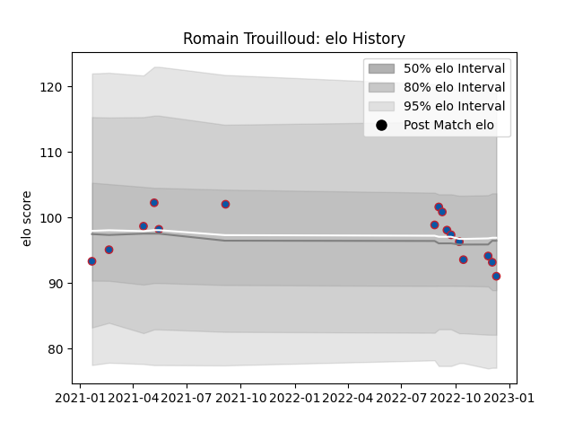

---  
layout: page  
title: Romain Trouilloud  
date: 2022-12-18 16:29:23.113768  
categories: player  
---
# Romain Trouilloud

## Positions: C

## Current elo: 93.0

## Current Percentile: 31.0

# Elo History

# Match History

| Team     |   Appearances |   Win Rate |
|:---------|--------------:|-----------:|
| Grenoble |            17 |   0.558824 |

| Opponent                   |   Matches |   Win Rate |
|:---------------------------|----------:|-----------:|
| Aurillac                   |         2 |        1   |
| Rouen                      |         2 |        0.5 |
| Vannes                     |         2 |        0.5 |
| Agen                       |         1 |        1   |
| Beziers                    |         1 |        1   |
| Biarritz Olympique         |         1 |        0.5 |
| Carcassonne                |         1 |        1   |
| Colomiers                  |         1 |        0   |
| Massy                      |         1 |        1   |
| Mont-de-Marsan             |         1 |        0   |
| Montauban                  |         1 |        0   |
| Oyonnax                    |         1 |        0   |
| Provence Rugby             |         1 |        0   |
| Valence Romans Drome Rugby |         1 |        1   |