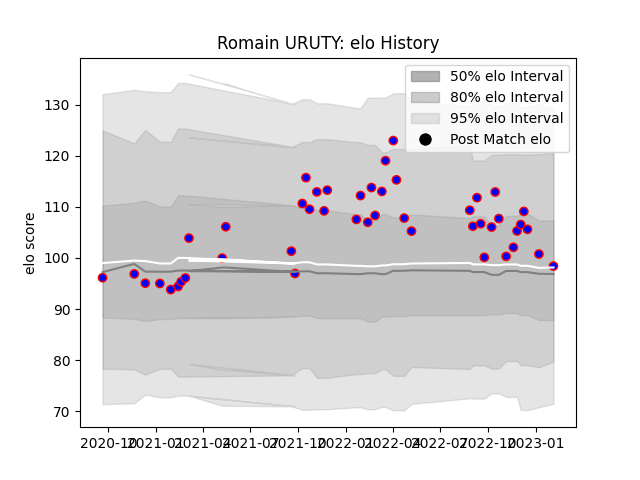

---  
layout: page  
title: Romain URUTY  
date: 2023-01-15 11:45:20.791720  
categories: player  
---
# Romain URUTY

## Positions: FH

## Current elo: 102.0

## Current Percentile: 72.0

# Elo History

# Match History

| Team    |   Appearances |   Win Rate |
|:--------|--------------:|-----------:|
| Beziers |            45 |   0.455556 |

| Opponent                   |   Matches |   Win Rate |
|:---------------------------|----------:|-----------:|
| Montauban                  |         5 |   0.8      |
| Nevers                     |         5 |   0.2      |
| Grenoble                   |         4 |   0.5      |
| Provence Rugby             |         3 |   0.333333 |
| Colomiers                  |         3 |   0.333333 |
| Oyonnax                    |         3 |   0.166667 |
| Mont-de-Marsan             |         3 |   0.333333 |
| Narbonne                   |         2 |   1        |
| US Bressane                |         2 |   0        |
| Rouen                      |         2 |   0.5      |
| Agen                       |         2 |   1        |
| Biarritz Olympique         |         2 |   0.5      |
| Bayonne                    |         2 |   0.5      |
| Vannes                     |         2 |   0.5      |
| Aurillac                   |         1 |   0        |
| Massy                      |         1 |   1        |
| Carcassonne                |         1 |   0        |
| Soyaux-Angouleme           |         1 |   0        |
| Valence Romans Drome Rugby |         1 |   1        |