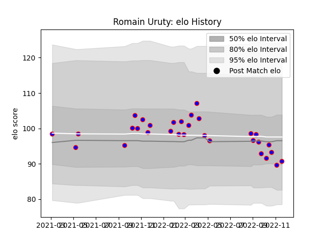

---  
layout: page  
title: Romain Uruty  
date: 2022-11-22 11:31:13.966868  
categories: player  
---
# Romain Uruty

## Positions: FH

## Current elo: 91.0

## Current Percentile: 23.0

# Elo History

# Match History

| Team    |   Appearances |   Win Rate |
|:--------|--------------:|-----------:|
| Beziers |            31 |   0.435484 |

| Opponent         |   Matches |   Win Rate |
|:-----------------|----------:|-----------:|
| Montauban        |         4 |   0.75     |
| Mont-de-Marsan   |         3 |   0.333333 |
| Grenoble         |         3 |   0.666667 |
| US Bressane      |         2 |   0        |
| Oyonnax          |         2 |   0.25     |
| Nevers           |         2 |   0        |
| Narbonne         |         2 |   1        |
| Vannes           |         2 |   0.5      |
| Colomiers        |         2 |   0.5      |
| Bayonne          |         2 |   0.5      |
| Aurillac         |         1 |   0        |
| Massy            |         1 |   1        |
| Carcassonne      |         1 |   0        |
| Provence Rugby   |         1 |   0        |
| Rouen            |         1 |   0        |
| Soyaux-Angouleme |         1 |   0        |
| Agen             |         1 |   1        |