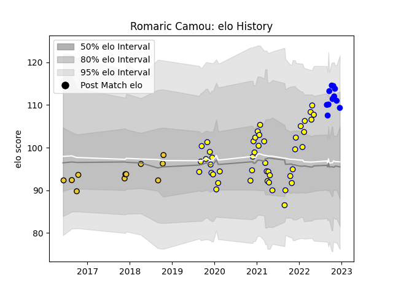

---  
layout: page  
title: Romaric Camou  
date: 2022-11-22 11:31:24.914661  
categories: player  
---
# Romaric Camou

## Positions: W, FB

## Current elo: 109.0

## Current Percentile: 86.0

# Elo History

# Match History

| Team        |   Appearances |   Win Rate |
|:------------|--------------:|-----------:|
| Nevers      |            46 |   0.608696 |
| La Rochelle |            11 |   0.5      |
| Vannes      |            10 |   0.6      |

| Opponent             |   Matches |   Win Rate |
|:---------------------|----------:|-----------:|
| Rouen                |         6 |   0.666667 |
| Beziers              |         5 |   1        |
| Biarritz Olympique   |         4 |   0.75     |
| Carcassonne          |         4 |   0.75     |
| Colomiers            |         4 |   0        |
| Mont-de-Marsan       |         4 |   0.75     |
| Montauban            |         3 |   0.666667 |
| Oyonnax              |         3 |   0        |
| Soyaux-Angouleme     |         3 |   0.333333 |
| Grenoble             |         3 |   0.666667 |
| Aurillac             |         3 |   1        |
| Montpellier Herault  |         3 |   0.333333 |
| US Bressane          |         2 |   1        |
| RC Enisei            |         2 |   1        |
| Provence Rugby       |         2 |   0.5      |
| Perpignan            |         2 |   0.5      |
| Agen                 |         2 |   0        |
| Clermont Auvergne    |         2 |   0.25     |
| Vannes               |         2 |   0.5      |
| Nevers               |         1 |   1        |
| Pau                  |         1 |   1        |
| Narbonne             |         1 |   1        |
| Massy                |         1 |   1        |
| Castres Olympique    |         1 |   0        |
| Benetton Treviso     |         1 |   1        |
| Stade Francais Paris |         1 |   0        |
| Bayonne              |         1 |   0        |