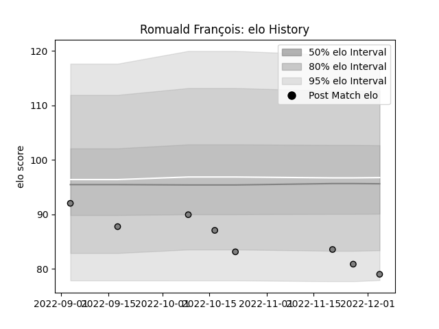

---  
layout: page  
title: Romuald François  
date: 2022-12-09 13:06:36.229851  
categories: player  
---
# Romuald François

## Positions: W

## Current elo: 79.0

## Current Percentile: 7.0

# Elo History

# Match History

| Team   |   Appearances |   Win Rate |
|:-------|--------------:|-----------:|
| Rennes |             8 |       0.25 |

| Opponent                   |   Matches |   Win Rate |
|:---------------------------|----------:|-----------:|
| Carqueiranne-Hyères        |         1 |          1 |
| Chambery                   |         1 |          0 |
| Cognac Saint Jean d'Angély |         1 |          1 |
| Narbonne                   |         1 |          0 |
| Nice                       |         1 |          0 |
| Suresnes                   |         1 |          0 |
| US Bressane                |         1 |          0 |
| Valence Romans Drome Rugby |         1 |          0 |