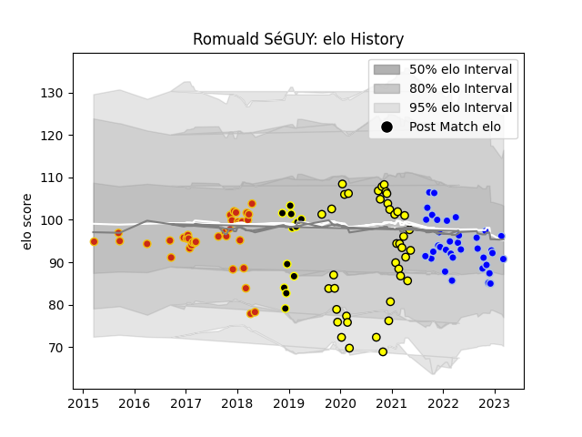

---  
layout: page  
title: Romuald SéGUY  
date: 2023-02-26 11:20:07.537425  
categories: player  
---
# Romuald SéGUY

## Positions: FH

## Current elo: 100.0

## Current Percentile: 49.0

# Elo History

# Match History

| Team           |   Appearances |   Win Rate |
|:---------------|--------------:|-----------:|
| Carcassonne    |            40 |   0.5125   |
| Colomiers      |            37 |   0.567568 |
| Perpignan      |            36 |   0.625    |
| Mont-de-Marsan |            13 |   0.384615 |

| Opponent                   |   Matches |   Win Rate |
|:---------------------------|----------:|-----------:|
| Aurillac                   |        12 |   0.5      |
| Mont-de-Marsan             |         8 |   0.375    |
| Beziers                    |         8 |   0.375    |
| Oyonnax                    |         8 |   0.375    |
| Nevers                     |         8 |   0.5      |
| Montauban                  |         8 |   0.875    |
| Grenoble                   |         8 |   0.75     |
| Vannes                     |         7 |   0.642857 |
| Biarritz Olympique         |         7 |   0.428571 |
| Carcassonne                |         6 |   0.666667 |
| Soyaux-Angouleme           |         5 |   0.9      |
| Provence Rugby             |         5 |   0.4      |
| Massy                      |         4 |   0.75     |
| Dax                        |         4 |   0.75     |
| Colomiers                  |         4 |   0.5      |
| Albi                       |         3 |   0.333333 |
| Perpignan                  |         3 |   0        |
| Rouen                      |         3 |   0.666667 |
| Bayonne                    |         3 |   0.666667 |
| US Bressane                |         3 |   0.333333 |
| Narbonne                   |         2 |   1        |
| Brive                      |         2 |   0.5      |
| Agen                       |         2 |   0.5      |
| Lyon                       |         1 |   0        |
| Bourgoin-Jallieu           |         1 |   1        |
| Valence Romans Drome Rugby |         1 |   0        |