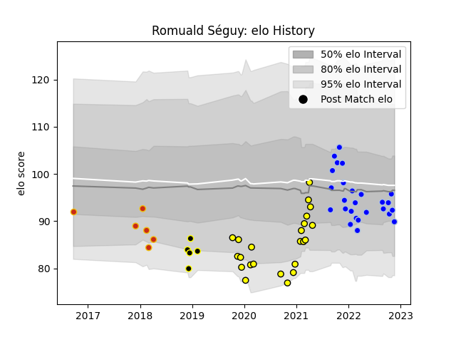

---  
layout: page  
title: Romuald Séguy  
date: 2022-12-14 11:26:39.705842  
categories: player  
---
# Romuald Séguy

## Positions: FH

## Current elo: 94.0

## Current Percentile: 26.0

# Elo History

# Match History

| Team           |   Appearances |   Win Rate |
|:---------------|--------------:|-----------:|
| Colomiers      |            29 |   0.655172 |
| Carcassonne    |            23 |   0.543478 |
| Perpignan      |             6 |   0.333333 |
| Mont-de-Marsan |             5 |   0.4      |

| Opponent                   |   Matches |   Win Rate |
|:---------------------------|----------:|-----------:|
| Aurillac                   |         6 |   0.666667 |
| Montauban                  |         5 |   0.8      |
| Mont-de-Marsan             |         5 |   0.4      |
| Oyonnax                    |         5 |   0.4      |
| Nevers                     |         5 |   0.6      |
| Provence Rugby             |         4 |   0.5      |
| Vannes                     |         4 |   0.375    |
| Carcassonne                |         4 |   0.5      |
| Biarritz Olympique         |         4 |   0.25     |
| Beziers                    |         4 |   0.75     |
| Grenoble                   |         3 |   1        |
| Rouen                      |         3 |   0.666667 |
| US Bressane                |         3 |   0.333333 |
| Bayonne                    |         2 |   0.5      |
| Massy                      |         1 |   1        |
| Brive                      |         1 |   1        |
| Narbonne                   |         1 |   1        |
| Soyaux-Angouleme           |         1 |   1        |
| Valence Romans Drome Rugby |         1 |   0        |
| Agen                       |         1 |   0        |