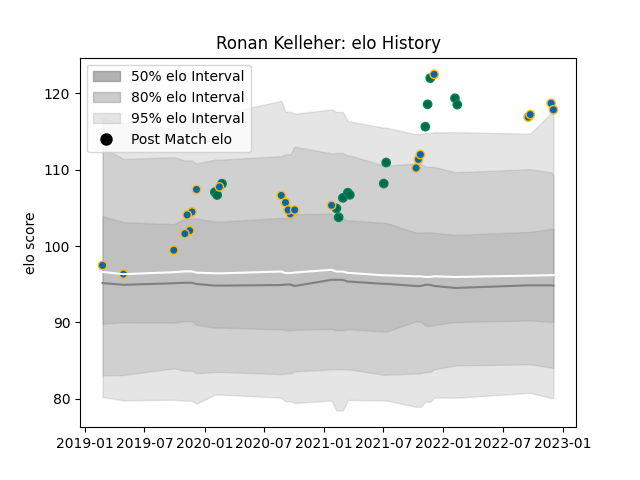

---  
layout: page  
title: Ronan Kelleher  
date: 2022-12-09 13:15:51.368072  
categories: player  
---
# Ronan Kelleher

## Positions: H

## Country: Ireland

## Current elo: 118.0

## Current Percentile: 96.0

# Elo History

# Match History

| Team     |   Appearances |   Win Rate |
|:---------|--------------:|-----------:|
| Leinster |            23 |   0.913043 |
| Ireland  |            15 |   0.733333 |

| Opponent                 |   Matches |   Win Rate |
|:-------------------------|----------:|-----------:|
| Munster                  |         3 |   1        |
| Wales                    |         3 |   0.666667 |
| Ulster                   |         3 |   0.666667 |
| Benetton Treviso         |         3 |   1        |
| Glasgow Warriors         |         2 |   1        |
| Scotland                 |         2 |   1        |
| Japan                    |         2 |   1        |
| Zebre                    |         2 |   1        |
| France                   |         2 |   0        |
| England                  |         2 |   0.5      |
| Dragons                  |         2 |   1        |
| Connacht                 |         2 |   1        |
| Italy                    |         1 |   1        |
| Lyon                     |         1 |   1        |
| New Zealand              |         1 |   1        |
| Northampton Saints       |         1 |   1        |
| Saracens                 |         1 |   0        |
| Scarlets                 |         1 |   1        |
| Southern Kings           |         1 |   1        |
| United States of America |         1 |   1        |
| Cheetahs                 |         1 |   1        |
| Argentina                |         1 |   1        |