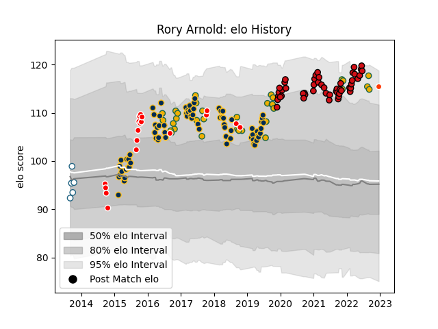

---  
layout: page  
title: Rory Arnold  
date: 2022-12-18 16:33:23.883784  
categories: player  
---
# Rory Arnold

## Positions: L

## Country: Australia

## Current elo: 116.0

## Current Percentile: 92.0

# Elo History

# Match History

| Team              |   Appearances |   Win Rate |
|:------------------|--------------:|-----------:|
| Brumbies          |            73 |   0.534247 |
| Stade Toulousain  |            49 |   0.683673 |
| Australia         |            33 |   0.439394 |
| Canberra Vikings  |            18 |   0.666667 |
| Griquas           |             5 |   0        |
| Hino Red Dolphins |             1 |   1        |

| Opponent                 |   Matches |   Win Rate |
|:-------------------------|----------:|-----------:|
| Melbourne Rebels         |         9 |   0.333333 |
| Queensland Reds          |         8 |   0.75     |
| South Africa             |         7 |   0.5      |
| Montpellier Herault      |         7 |   0.857143 |
| New South Wales Waratahs |         7 |   0.714286 |
| Hurricanes               |         6 |   0.333333 |
| La Rochelle              |         6 |   1        |
| Argentina                |         5 |   0.6      |
| Western Force            |         5 |   1        |
| New Zealand              |         5 |   0.2      |
| Brisbane City            |         4 |   0.25     |
| England                  |         4 |   0        |
| Lions                    |         4 |   0.5      |
| Jaguares                 |         4 |   0.25     |
| Highlanders              |         4 |   0.25     |
| Racing 92                |         4 |   0.25     |
| Melbourne Rising         |         4 |   0.75     |
| Crusaders                |         4 |   0        |
| Chiefs                   |         4 |   0.25     |
| Stormers                 |         4 |   0.5      |
| Bordeaux Begles          |         3 |   1        |
| Sharks                   |         3 |   0.666667 |
| Bayonne                  |         3 |   0.333333 |
| Lyon                     |         3 |   0.333333 |
| Bulls                    |         3 |   1        |
| Sunwolves                |         3 |   1        |
| Blues                    |         3 |   0.333333 |
| Wales                    |         3 |   0.333333 |
| Stade Francais Paris     |         3 |   0.333333 |
| Pau                      |         3 |   0.666667 |
| Queensland Country       |         3 |   0.666667 |
| Scotland                 |         3 |   0.333333 |
| Sydney Stars             |         2 |   0.75     |
| Toulon                   |         2 |   0.75     |
| North Harbour Rays       |         2 |   0.75     |
| Agen                     |         2 |   1        |
| Biarritz Olympique       |         2 |   1        |
| Castres Olympique        |         2 |   0.5      |
| Clermont Auvergne        |         2 |   0.5      |
| Fiji                     |         2 |   1        |
| Connacht                 |         2 |   1        |
| NSW Country Eagles       |         1 |   1        |
| Southern Kings           |         1 |   1        |
| Blue Bulls               |         1 |   0        |
| Uruguay                  |         1 |   1        |
| Ulster                   |         1 |   1        |
| Brive                    |         1 |   1        |
| Sydney Rays              |         1 |   1        |
| Cheetahs                 |         1 |   1        |
| Exeter Chiefs            |         1 |   0        |
| Natal Sharks             |         1 |   0        |
| Free State Cheetahs      |         1 |   0        |
| Georgia                  |         1 |   1        |
| Gloucester Rugby         |         1 |   1        |
| Golden Lions             |         1 |   0        |
| Perpignan                |         1 |   0        |
| Greater Sydney Rams      |         1 |   1        |
| Ireland                  |         1 |   0        |
| Italy                    |         1 |   1        |
| Kamaishi Seawaves        |         1 |   1        |
| Western Province         |         1 |   0        |