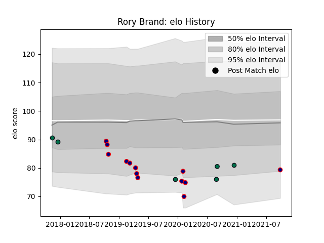

---  
layout: page  
title: Rory Brand  
date: 2023-03-04 11:42:14.172943  
categories: player  
---
# Rory Brand

## Positions: SH

## Current elo: 79.0

## Current Percentile: None

# Elo History

# Match History

| Team            |   Appearances |   Win Rate |
|:----------------|--------------:|-----------:|
| London Scottish |            13 |   0.230769 |
| London Irish    |             6 |   0.166667 |

| Opponent             |   Matches |   Win Rate |
|:---------------------|----------:|-----------:|
| Doncaster            |         3 |        0   |
| Coventry             |         2 |        0.5 |
| Agen                 |         1 |        1   |
| Ampthill             |         1 |        0   |
| Bedford              |         1 |        0   |
| Cornish Pirates      |         1 |        1   |
| Ealing Trailfinders  |         1 |        0   |
| Gloucester Rugby     |         1 |        0   |
| Hartpury College     |         1 |        0   |
| Leicester Tigers     |         1 |        0   |
| Nottingham           |         1 |        0   |
| Richmond             |         1 |        0   |
| Saracens             |         1 |        0   |
| Stade Francais Paris |         1 |        0   |
| Toulon               |         1 |        0   |
| Yorkshire Carnegie   |         1 |        1   |