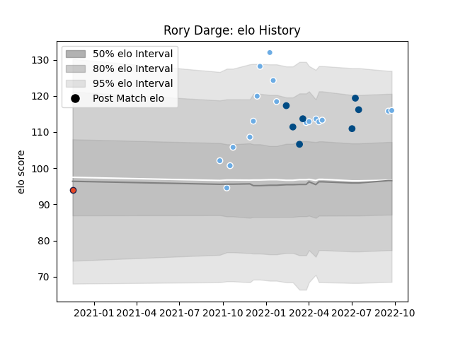

---  
layout: page  
title: Rory Darge  
date: 2023-02-26 11:19:20.422766  
categories: player  
---
# Rory Darge

## Positions: FL

## Country: Scotland

## Current elo: 116.0

## Current Percentile: 86.0

# Elo History

# Match History

| Team             |   Appearances |   Win Rate |
|:-----------------|--------------:|-----------:|
| Glasgow Warriors |            18 |   0.444444 |
| Scotland         |             7 |   0.285714 |
| Edinburgh        |             1 |   0        |

| Opponent          |   Matches |   Win Rate |
|:------------------|----------:|-----------:|
| Argentina         |         3 |   0.333333 |
| Exeter Chiefs     |         2 |   0.5      |
| Leinster          |         2 |   0        |
| Benetton Treviso  |         2 |   0        |
| La Rochelle       |         2 |   0        |
| Cardiff Blues     |         2 |   0.5      |
| Zebre             |         2 |   1        |
| Dragons           |         1 |   1        |
| France            |         1 |   0        |
| Ireland           |         1 |   0        |
| Italy             |         1 |   1        |
| Bulls             |         1 |   0        |
| Lions             |         1 |   1        |
| Newcastle Falcons |         1 |   1        |
| Ospreys           |         1 |   1        |
| Stormers          |         1 |   0        |
| Ulster            |         1 |   0        |
| Wales             |         1 |   0        |