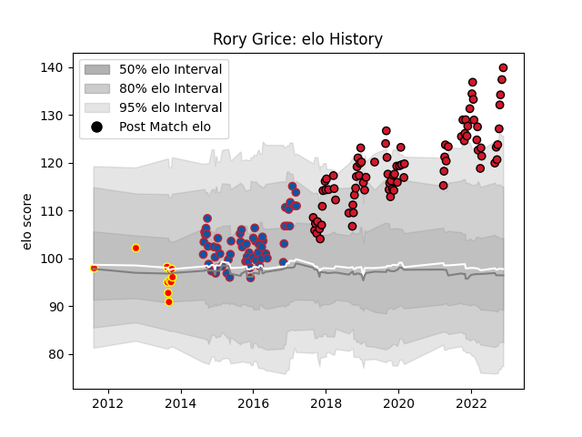

---  
layout: page  
title: Rory Grice  
date: 2022-12-18 16:15:18.918940  
categories: player  
---
# Rory Grice

## Positions: N8

## Current elo: 135.0

## Current Percentile: 98.0

# Elo History

# Match History

| Team     |   Appearances |   Win Rate |
|:---------|--------------:|-----------:|
| Oyonnax  |            88 |   0.573864 |
| Grenoble |            60 |   0.466667 |
| Waikato  |            11 |   0.545455 |

| Opponent                   |   Matches |   Win Rate |
|:---------------------------|----------:|-----------:|
| Agen                       |         7 |  0.857143  |
| Beziers                    |         7 |  0.642857  |
| Racing 92                  |         7 |  0.285714  |
| Bordeaux Begles            |         7 |  0.142857  |
| Brive                      |         7 |  0.285714  |
| Colomiers                  |         6 |  0.5       |
| Stade Toulousain           |         6 |  0.583333  |
| La Rochelle                |         6 |  0.416667  |
| Clermont Auvergne          |         6 |  0.0833333 |
| Toulon                     |         5 |  0.4       |
| Stade Francais Paris       |         5 |  0.4       |
| Nevers                     |         5 |  0.8       |
| Mont-de-Marsan             |         5 |  0.6       |
| Montauban                  |         5 |  0.6       |
| Bayonne                    |         5 |  0.4       |
| Pau                        |         4 |  0.25      |
| Oyonnax                    |         4 |  0.75      |
| Grenoble                   |         4 |  0.5       |
| Rouen                      |         4 |  0.75      |
| Biarritz Olympique         |         4 |  0.25      |
| US Bressane                |         4 |  0.75      |
| Montpellier Herault        |         4 |  0.25      |
| Provence Rugby             |         4 |  0.875     |
| Vannes                     |         3 |  0.666667  |
| Castres Olympique          |         3 |  0.333333  |
| Lyon                       |         3 |  0.333333  |
| Carcassonne                |         3 |  1         |
| Soyaux-Angouleme           |         3 |  1         |
| Counties Manukau           |         3 |  0.666667  |
| Aurillac                   |         2 |  0         |
| London Irish               |         2 |  1         |
| Bay of Plenty              |         1 |  1         |
| Taranaki                   |         1 |  1         |
| Rovigo                     |         1 |  1         |
| Valence Romans Drome Rugby |         1 |  1         |
| Southland                  |         1 |  0         |
| Connacht                   |         1 |  1         |
| Roval Drome XV             |         1 |  1         |
| Perpignan                  |         1 |  1         |
| Otago                      |         1 |  0         |
| Northland                  |         1 |  1         |
| Canterbury                 |         1 |  0         |
| Narbonne                   |         1 |  1         |
| Auckland                   |         1 |  1         |
| Massy                      |         1 |  1         |
| Edinburgh                  |         1 |  1         |
| Wellington                 |         1 |  0         |