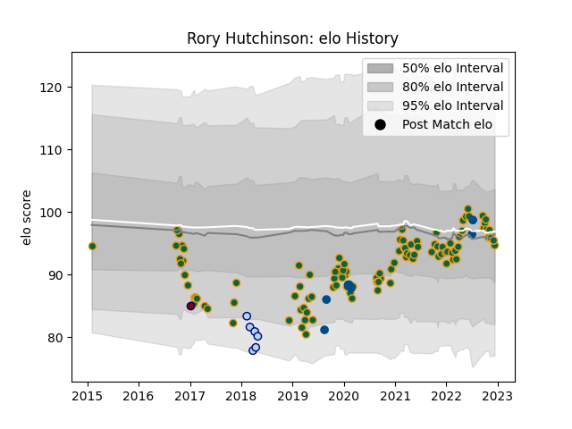

---  
layout: page  
title: Rory Hutchinson  
date: 2022-12-14 11:26:14.368425  
categories: player  
---
# Rory Hutchinson

## Positions: C

## Country: Scotland

## Current elo: 95.0

## Current Percentile: 47.0

# Elo History

# Match History

| Team               |   Appearances |   Win Rate |
|:-------------------|--------------:|-----------:|
| Northampton Saints |           106 |   0.509434 |
| Scotland           |             7 |   0.428571 |
| Bedford            |             6 |   0.666667 |
| Rotherham Titans   |             1 |   0        |

| Opponent            |   Matches |   Win Rate |
|:--------------------|----------:|-----------:|
| Leicester Tigers    |        10 |   0.3      |
| Gloucester Rugby    |         9 |   0.555556 |
| Exeter Chiefs       |         9 |   0.333333 |
| Harlequins          |         9 |   0.444444 |
| Worcester Warriors  |         8 |   1        |
| Bath Rugby          |         8 |   0.375    |
| Newcastle Falcons   |         8 |   0.625    |
| Bristol Rugby       |         7 |   0.428571 |
| Saracens            |         7 |   0.142857 |
| Sale Sharks         |         6 |   0.333333 |
| Wasps               |         6 |   0.666667 |
| London Irish        |         5 |   0.8      |
| Lyon                |         2 |   1        |
| Argentina           |         2 |   0.5      |
| Dragons             |         2 |   1        |
| Benetton Treviso    |         2 |   1        |
| Leinster            |         2 |   0        |
| Richmond            |         1 |   1        |
| Montpellier Herault |         1 |   1        |
| Scarlets            |         1 |   1        |
| Timisoara Saracens  |         1 |   1        |
| London Scottish     |         1 |   0        |
| Italy               |         1 |   1        |
| La Rochelle         |         1 |   0        |
| Jersey              |         1 |   0        |
| Ireland             |         1 |   0        |
| Hartpury College    |         1 |   1        |
| Georgia             |         1 |   1        |
| France              |         1 |   0        |
| England             |         1 |   0        |
| Doncaster           |         1 |   1        |
| Cornish Pirates     |         1 |   0        |
| Clermont Auvergne   |         1 |   0        |
| Castres Olympique   |         1 |   0        |
| Yorkshire Carnegie  |         1 |   1        |