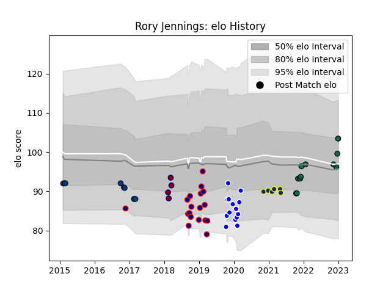

---  
layout: page  
title: Rory Jennings  
date: 2022-11-16 11:38:27.178365  
categories: player  
---
# Rory Jennings

## Positions: FH, C

## Current elo: 101.0

## Current Percentile: 68.0

# Elo History

# Match History

| Team              |   Appearances |   Win Rate |
|:------------------|--------------:|-----------:|
| London Scottish   |            18 |   0.333333 |
| Coventry          |            14 |   0.607143 |
| Bath Rugby        |             8 |   0.375    |
| London Irish      |             8 |   0.625    |
| Clermont Auvergne |             6 |   0.5      |
| Rotherham Titans  |             3 |   0        |

| Opponent            |   Matches |   Win Rate |
|:--------------------|----------:|-----------:|
| Bedford             |         5 |   0.4      |
| Ealing Trailfinders |         5 |   0.1      |
| Yorkshire Carnegie  |         3 |   0.666667 |
| Doncaster           |         3 |   0.666667 |
| Jersey              |         3 |   0.666667 |
| Exeter Chiefs       |         3 |   0.333333 |
| Harlequins          |         3 |   1        |
| Nottingham          |         3 |   0.666667 |
| Coventry            |         2 |   0.5      |
| Cornish Pirates     |         2 |   0.5      |
| Gloucester Rugby    |         2 |   0.75     |
| Hartpury College    |         2 |   0.5      |
| London Irish        |         2 |   0        |
| Saracens            |         2 |   0.25     |
| Richmond            |         2 |   0        |
| Newcastle Falcons   |         2 |   0.5      |
| Pau                 |         1 |   1        |
| Toulon              |         1 |   0        |
| Scarlets            |         1 |   0        |
| Wasps               |         1 |   0        |
| Racing 92           |         1 |   0        |
| Agen                |         1 |   1        |
| Northampton Saints  |         1 |   0        |
| Lyon                |         1 |   1        |
| London Scottish     |         1 |   1        |
| La Rochelle         |         1 |   0        |
| Brive               |         1 |   1        |
| Bristol Rugby       |         1 |   0        |
| Leicester Tigers    |         1 |   0        |