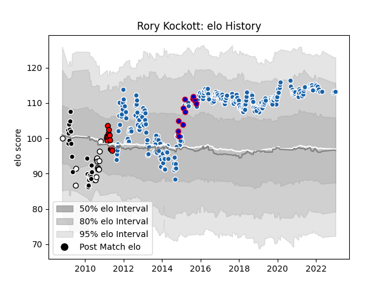

---  
layout: page  
title: Rory Kockott  
date: 2022-12-14 11:32:54.511960  
categories: player  
---
# Rory Kockott

## Positions: SH

## Country: France

## Current elo: 105.0

## Current Percentile: 79.0

# Elo History

# Match History

| Team              |   Appearances |   Win Rate |
|:------------------|--------------:|-----------:|
| Castres Olympique |           259 |   0.542471 |
| Sharks            |            25 |   0.6      |
| Lions             |            15 |   0.2      |
| Natal Sharks      |             9 |   0.666667 |
| France            |             6 |   0.5      |

| Opponent                 |   Matches |   Win Rate |
|:-------------------------|----------:|-----------:|
| Racing 92                |        22 |   0.409091 |
| Montpellier Herault      |        21 |   0.571429 |
| Stade Toulousain         |        19 |   0.5      |
| Toulon                   |        19 |   0.421053 |
| Clermont Auvergne        |        17 |   0.441176 |
| Stade Francais Paris     |        17 |   0.441176 |
| Lyon                     |        13 |   0.653846 |
| Agen                     |        12 |   0.75     |
| Brive                    |        12 |   0.75     |
| Bordeaux Begles          |        12 |   0.583333 |
| Pau                      |        11 |   0.727273 |
| La Rochelle              |        11 |   0.454545 |
| Bayonne                  |         9 |   0.611111 |
| Grenoble                 |         9 |   0.777778 |
| Northampton Saints       |         8 |   0.5      |
| Biarritz Olympique       |         6 |   0.75     |
| Oyonnax                  |         6 |   0.833333 |
| Perpignan                |         6 |   0.666667 |
| Munster                  |         5 |   0.3      |
| Bulls                    |         4 |   0        |
| Cheetahs                 |         4 |   0.25     |
| Stormers                 |         4 |   0.5      |
| Queensland Reds          |         3 |   0.333333 |
| Western Force            |         3 |   0.666667 |
| Western Province         |         3 |   0.333333 |
| Leinster                 |         3 |   0        |
| Exeter Chiefs            |         3 |   0.333333 |
| Hurricanes               |         3 |   0.666667 |
| Blues                    |         3 |   0.666667 |
| Highlanders              |         3 |   1        |
| Brumbies                 |         3 |   0.666667 |
| Harlequins               |         3 |   0        |
| Chiefs                   |         3 |   0.333333 |
| Ospreys                  |         2 |   0.5      |
| Blue Bulls               |         2 |   1        |
| Ulster                   |         2 |   0        |
| Crusaders                |         2 |   0        |
| Gloucester Rugby         |         2 |   0.5      |
| Worcester Warriors       |         2 |   1        |
| Lions                    |         2 |   1        |
| New South Wales Waratahs |         2 |   0        |
| Golden Lions             |         1 |   1        |
| New Zealand              |         1 |   0        |
| Leicester Tigers         |         1 |   0        |
| Leopards                 |         1 |   1        |
| Wasps                    |         1 |   0        |
| Boland Cavaliers         |         1 |   1        |
| Mont-de-Marsan           |         1 |   1        |
| Griquas                  |         1 |   0        |
| Sharks                   |         1 |   0        |
| Scotland                 |         1 |   1        |
| Scarlets                 |         1 |   0        |
| Romania                  |         1 |   1        |
| Dragons                  |         1 |   1        |
| RC Enisei                |         1 |   1        |
| England                  |         1 |   0        |
| Ireland                  |         1 |   0        |
| Glasgow Warriors         |         1 |   1        |
| Italy                    |         1 |   1        |