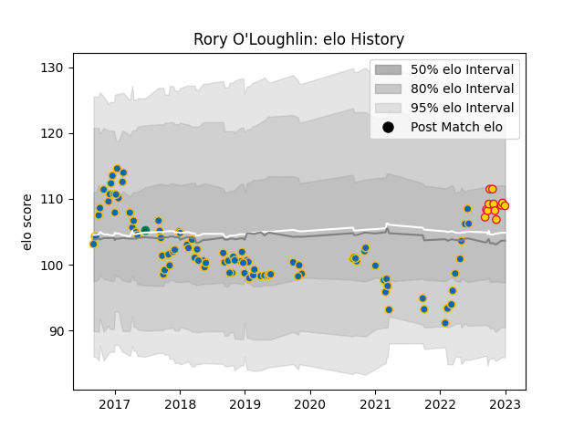

---  
layout: page  
title: Rory O'Loughlin  
date: 2023-03-17 17:39:38.365450  
categories: player  
---
# Rory O'Loughlin

## Positions: C, W

## Country: Ireland

## Current elo: 91.0

## Current Percentile: None

# Elo History

# Match History

| Team          |   Appearances |   Win Rate |
|:--------------|--------------:|-----------:|
| Leinster      |            98 |   0.77551  |
| Exeter Chiefs |            15 |   0.666667 |
| Ireland       |             1 |   1        |

| Opponent            |   Matches |   Win Rate |
|:--------------------|----------:|-----------:|
| Munster             |        12 |   0.833333 |
| Benetton Treviso    |         8 |   0.875    |
| Ulster              |         8 |   0.75     |
| Connacht            |         7 |   0.857143 |
| Glasgow Warriors    |         7 |   0.714286 |
| Dragons             |         6 |   1        |
| Edinburgh           |         6 |   0.833333 |
| Scarlets            |         6 |   0.583333 |
| Zebre               |         5 |   1        |
| Cardiff Blues       |         5 |   0.8      |
| Saracens            |         5 |   0.2      |
| Ospreys             |         5 |   0.6      |
| Northampton Saints  |         4 |   0.75     |
| Bulls               |         3 |   0.666667 |
| Stade Toulousain    |         3 |   0.666667 |
| Southern Kings      |         3 |   1        |
| Bath Rugby          |         2 |   1        |
| Castres Olympique   |         2 |   0.75     |
| Gloucester Rugby    |         2 |   0.5      |
| London Irish        |         1 |   1        |
| Sharks              |         1 |   0        |
| Worcester Warriors  |         1 |   1        |
| Wasps               |         1 |   1        |
| Bristol Rugby       |         1 |   1        |
| Stormers            |         1 |   0        |
| Cheetahs            |         1 |   0        |
| Exeter Chiefs       |         1 |   1        |
| Leicester Tigers    |         1 |   1        |
| Sale Sharks         |         1 |   0        |
| Racing 92           |         1 |   1        |
| Harlequins          |         1 |   1        |
| Japan               |         1 |   1        |
| Newcastle Falcons   |         1 |   1        |
| Montpellier Herault |         1 |   1        |