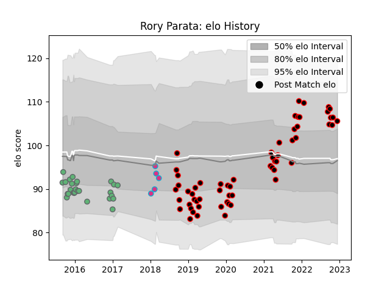

---  
layout: page  
title: Rory Parata  
date: 2023-03-21 18:06:55.596580  
categories: player  
---
# Rory Parata

Last updated: 2023-03-21
## Positions: C

## Current elo: 90.0

## Current Percentile: 39.0

# Elo History

# Match History

| Team            |   Appearances |   Win Rate |
|:----------------|--------------:|-----------:|
| Cornish Pirates |            61 |   0.622951 |
| Connacht        |            28 |   0.571429 |
| Zebre           |             5 |   0.2      |

| Opponent               |   Matches |   Win Rate |
|:-----------------------|----------:|-----------:|
| Nottingham             |         8 |   0.875    |
| Jersey                 |         6 |   0.166667 |
| Coventry               |         6 |   0.5      |
| Doncaster              |         5 |   0.8      |
| Richmond               |         5 |   1        |
| London Scottish        |         5 |   0.6      |
| Bedford                |         5 |   0.6      |
| Hartpury College       |         5 |   0.8      |
| Ampthill               |         5 |   0.8      |
| Ealing Trailfinders    |         4 |   0.25     |
| Dragons                |         3 |   1        |
| Cardiff Blues          |         3 |   0.333333 |
| Yorkshire Carnegie     |         3 |   0.666667 |
| Newcastle Falcons      |         3 |   0.333333 |
| Glasgow Warriors       |         3 |   0        |
| Ospreys                |         2 |   0.5      |
| Wasps                  |         2 |   0.5      |
| Ulster                 |         2 |   0        |
| Scarlets               |         2 |   0.5      |
| Benetton Treviso       |         2 |   0.5      |
| RC Enisei              |         2 |   1        |
| Zebre                  |         2 |   1        |
| Brive                  |         2 |   0.5      |
| Munster                |         2 |   0        |
| Enisey-STM Krasnoyarsk |         1 |   1        |
| Saracens               |         1 |   1        |
| Caldy                  |         1 |   0        |
| London Irish           |         1 |   0        |
| Leinster               |         1 |   0        |
| Edinburgh              |         1 |   1        |
| Connacht               |         1 |   1        |