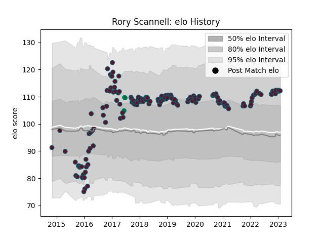

---  
layout: page  
title: Rory Scannell  
date: 2023-02-02 19:10:44.674648  
categories: player  
---
# Rory Scannell

## Positions: C

## Country: Ireland

## Current elo: 112.0

## Current Percentile: 82.0

# Elo History

# Match History

| Team    |   Appearances |   Win Rate |
|:--------|--------------:|-----------:|
| Munster |           165 |   0.687879 |
| Ireland |             3 |   1        |

| Opponent                 |   Matches |   Win Rate |
|:-------------------------|----------:|-----------:|
| Leinster                 |        16 |   0.125    |
| Cardiff Blues            |        14 |   0.714286 |
| Ospreys                  |        12 |   0.916667 |
| Connacht                 |        12 |   0.583333 |
| Glasgow Warriors         |        11 |   0.636364 |
| Edinburgh                |        11 |   0.818182 |
| Benetton Treviso         |        10 |   1        |
| Ulster                   |        10 |   0.7      |
| Zebre                    |         9 |   1        |
| Scarlets                 |         8 |   0.625    |
| Dragons                  |         7 |   0.857143 |
| Racing 92                |         7 |   0.5      |
| Leicester Tigers         |         6 |   0.5      |
| Castres Olympique        |         5 |   0.7      |
| Southern Kings           |         4 |   1        |
| Cheetahs                 |         4 |   1        |
| Saracens                 |         4 |   0.25     |
| Stade Toulousain         |         2 |   0.5      |
| Stade Francais Paris     |         2 |   0.5      |
| Exeter Chiefs            |         2 |   0.75     |
| Gloucester Rugby         |         2 |   1        |
| Japan                    |         2 |   1        |
| Sharks                   |         1 |   1        |
| Bulls                    |         1 |   0        |
| Lions                    |         1 |   1        |
| Stormers                 |         1 |   1        |
| Toulon                   |         1 |   1        |
| United States of America |         1 |   1        |
| Wasps                    |         1 |   1        |
| Northampton Saints       |         1 |   1        |