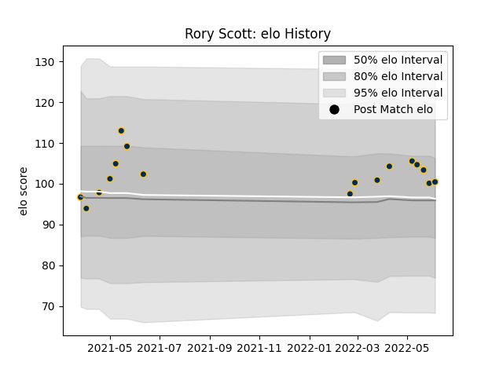

---  
layout: page  
title: Rory Scott  
date: 2023-03-16 19:49:28.868280  
categories: player  
---
# Rory Scott

## Positions: FL

## Current elo: 103.0

## Current Percentile: 79.0

# Elo History

# Match History

| Team     |   Appearances |   Win Rate |
|:---------|--------------:|-----------:|
| Brumbies |            20 |       0.65 |

| Opponent                 |   Matches |   Win Rate |
|:-------------------------|----------:|-----------:|
| Western Force            |         4 |        1   |
| Blues                    |         2 |        0.5 |
| Chiefs                   |         2 |        0.5 |
| Crusaders                |         2 |        0   |
| Fijian Drua              |         2 |        1   |
| New South Wales Waratahs |         2 |        1   |
| Queensland Reds          |         2 |        0.5 |
| Highlanders              |         1 |        0   |
| Hurricanes               |         1 |        1   |
| Melbourne Rebels         |         1 |        1   |
| Moana Pasifika           |         1 |        0   |