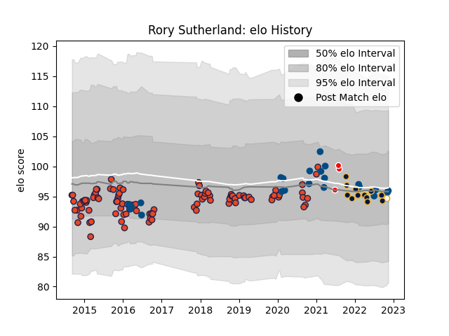

---  
layout: page  
title: Rory Sutherland  
date: 2022-11-22 11:45:32.197548  
categories: player  
---
# Rory Sutherland

## Positions: P

## Country: Scotland

## Current elo: 94.0

## Current Percentile: 41.0

# Elo History

# Match History

| Team                    |   Appearances |   Win Rate |
|:------------------------|--------------:|-----------:|
| Edinburgh               |            98 |   0.55102  |
| Scotland                |            22 |   0.590909 |
| Worcester Warriors      |            12 |   0.166667 |
| British and Irish Lions |             3 |   0.666667 |
| Ulster                  |             1 |   1        |

| Opponent             |   Matches |   Win Rate |
|:---------------------|----------:|-----------:|
| Glasgow Warriors     |        11 |   0.636364 |
| Munster              |         9 |   0.444444 |
| Dragons              |         8 |   0.75     |
| Cardiff Blues        |         7 |   0.142857 |
| Ulster               |         6 |   0.166667 |
| Benetton Treviso     |         6 |   0.833333 |
| Leinster             |         6 |   0.333333 |
| Scarlets             |         5 |   0.8      |
| Connacht             |         5 |   0.2      |
| London Irish         |         5 |   0.6      |
| Agen                 |         4 |   1        |
| Ospreys              |         4 |   0.75     |
| Zebre                |         4 |   0.25     |
| Bordeaux Begles      |         3 |   0.333333 |
| England              |         3 |   0.666667 |
| Wasps                |         3 |   0.666667 |
| Wales                |         3 |   0.333333 |
| Ireland              |         3 |   0        |
| Italy                |         3 |   1        |
| Japan                |         3 |   1        |
| France               |         3 |   1        |
| Southern Kings       |         2 |   1        |
| Cheetahs             |         2 |   0.5      |
| Northampton Saints   |         2 |   0        |
| Stade Francais Paris |         2 |   0.5      |
| Exeter Chiefs        |         2 |   0        |
| Lyon                 |         2 |   0.5      |
| London Welsh         |         2 |   1        |
| South Africa         |         2 |   0.5      |
| Argentina            |         2 |   0        |
| Bath Rugby           |         2 |   0.5      |
| Timisoara Saracens   |         1 |   1        |
| Toulon               |         1 |   1        |
| Georgia              |         1 |   1        |
| New Zealand          |         1 |   0        |
| Saracens             |         1 |   0        |
| Newcastle Falcons    |         1 |   0        |
| Montpellier Herault  |         1 |   0        |
| Fiji                 |         1 |   1        |
| Krasny Yar           |         1 |   1        |
| Grenoble             |         1 |   1        |
| Gloucester Rugby     |         1 |   0        |
| Leicester Tigers     |         1 |   0        |