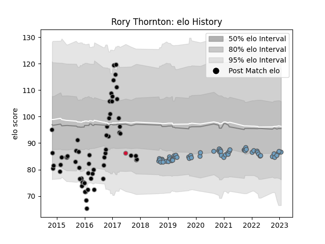

---  
layout: page  
title: Rory Thornton  
date: 2023-02-02 18:56:43.406146  
categories: player  
---
# Rory Thornton

## Positions: L

## Country: Wales

## Current elo: 86.0

## Current Percentile: 25.0

# Elo History

# Match History

| Team          |   Appearances |   Win Rate |
|:--------------|--------------:|-----------:|
| Ospreys       |            65 |   0.561538 |
| Cardiff Blues |            58 |   0.362069 |
| Wales         |             1 |   1        |

| Opponent             |   Matches |   Win Rate |
|:---------------------|----------:|-----------:|
| Edinburgh            |        13 |   0.384615 |
| Glasgow Warriors     |        10 |   0.35     |
| Munster              |        10 |   0.2      |
| Connacht             |         9 |   0.555556 |
| Benetton Treviso     |         8 |   0.75     |
| Scarlets             |         7 |   0.571429 |
| Leinster             |         7 |   0.142857 |
| Ulster               |         6 |   0        |
| Cardiff Blues        |         6 |   0.833333 |
| Ospreys              |         5 |   0        |
| Zebre                |         5 |   0.8      |
| Dragons              |         5 |   0.8      |
| Lyon                 |         4 |   1        |
| Newcastle Falcons    |         3 |   1        |
| Exeter Chiefs        |         2 |   0.5      |
| Grenoble             |         2 |   1        |
| Stormers             |         2 |   0.5      |
| Southern Kings       |         2 |   1        |
| Sharks               |         2 |   1        |
| Saracens             |         2 |   0        |
| Lions                |         2 |   0        |
| Cheetahs             |         2 |   0.5      |
| Clermont Auvergne    |         2 |   0.5      |
| Bordeaux Begles      |         2 |   0.5      |
| Bulls                |         1 |   0        |
| Stade Francais Paris |         1 |   0        |
| Harlequins           |         1 |   0        |
| Brive                |         1 |   0        |
| Wasps                |         1 |   0        |
| Samoa                |         1 |   1        |