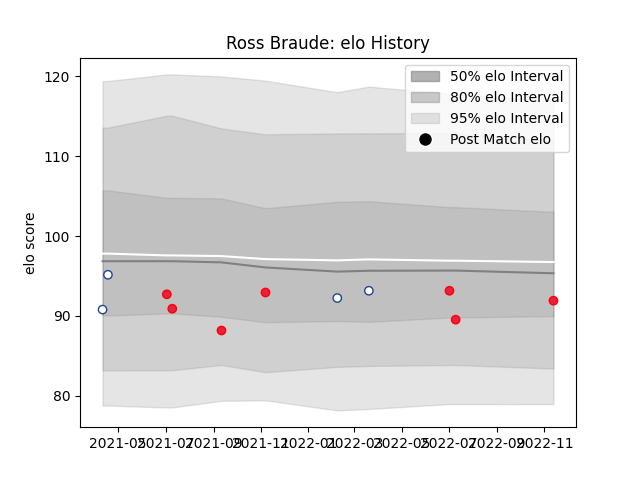

---  
layout: page  
title: Ross Braude  
date: 2023-03-21 18:07:23.401554  
categories: player  
---
# Ross Braude

Last updated: 2023-03-21
## Positions: SH

## Country: Canada

## Current elo: 94.0

## Current Percentile: 66.0

# Elo History

# Match History

| Team           |   Appearances |   Win Rate |
|:---------------|--------------:|-----------:|
| Toronto Arrows |            23 |   0.521739 |
| Canada         |             9 |   0.333333 |

| Opponent                 |   Matches |   Win Rate |
|:-------------------------|----------:|-----------:|
| NOLA Gold                |         3 |   0.333333 |
| New England Free Jacks   |         3 |   0.333333 |
| Old Glory DC             |         2 |   1        |
| Rugby ATL                |         2 |   0        |
| L. A. Giltinis           |         2 |   0        |
| Seattle Seawolves        |         2 |   0.5      |
| Belgium                  |         2 |   1        |
| Rugby New York           |         2 |   1        |
| R.U. New York            |         2 |   1        |
| Utah Warriors            |         1 |   1        |
| United States of America |         1 |   0        |
| Spain                    |         1 |   0        |
| San Diego Legion         |         1 |   0        |
| Austin Gilgronis         |         1 |   0        |
| Portugal                 |         1 |   0        |
| Netherlands              |         1 |   1        |
| Namibia                  |         1 |   0        |
| Houston SaberCats        |         1 |   1        |
| England                  |         1 |   0        |
| Dallas Jackals           |         1 |   1        |
| Wales                    |         1 |   0        |