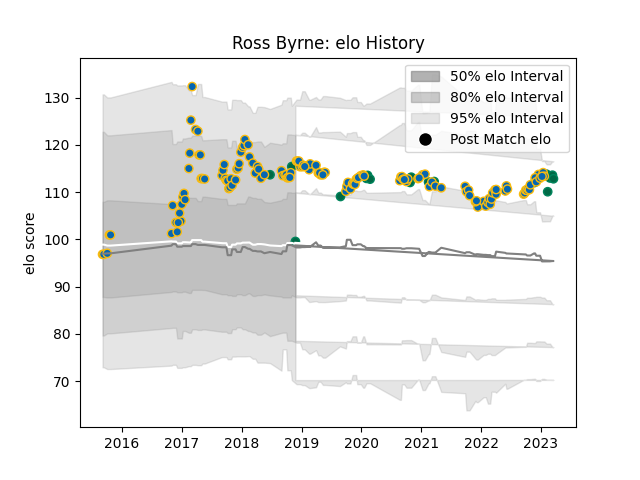

---  
layout: page  
title: Ross Byrne  
date: 2023-01-13 11:27:03.602231  
categories: player  
---
# Ross Byrne

## Positions: FH

## Country: Ireland

## Current elo: 99.0

## Current Percentile: 57.0

# Elo History

# Match History

| Team     |   Appearances |   Win Rate |
|:---------|--------------:|-----------:|
| Leinster |           128 |   0.8125   |
| Ireland  |            12 |   0.666667 |

| Opponent                 |   Matches |   Win Rate |
|:-------------------------|----------:|-----------:|
| Ulster                   |        15 |   0.733333 |
| Munster                  |        13 |   0.923077 |
| Glasgow Warriors         |        11 |   0.818182 |
| Benetton Treviso         |        10 |   0.9      |
| Connacht                 |         9 |   0.888889 |
| Scarlets                 |         9 |   0.5      |
| Dragons                  |         9 |   1        |
| Edinburgh                |         6 |   0.666667 |
| Zebre                    |         6 |   1        |
| Cardiff Blues            |         5 |   0.8      |
| Ospreys                  |         4 |   0.75     |
| Northampton Saints       |         4 |   1        |
| Stade Toulousain         |         3 |   0.666667 |
| Montpellier Herault      |         3 |   1        |
| England                  |         3 |   0.333333 |
| Southern Kings           |         2 |   1        |
| Saracens                 |         2 |   0        |
| Wasps                    |         2 |   1        |
| Australia                |         2 |   1        |
| Lyon                     |         2 |   1        |
| Bath Rugby               |         2 |   1        |
| Italy                    |         2 |   1        |
| France                   |         2 |   0        |
| Exeter Chiefs            |         2 |   1        |
| Bulls                    |         2 |   0.5      |
| Gloucester Rugby         |         1 |   1        |
| Racing 92                |         1 |   1        |
| Scotland                 |         1 |   1        |
| Sharks                   |         1 |   1        |
| Clermont Auvergne        |         1 |   0        |
| Cheetahs                 |         1 |   0        |
| Castres Olympique        |         1 |   0.5      |
| United States of America |         1 |   1        |
| Wales                    |         1 |   1        |
| Lions                    |         1 |   1        |