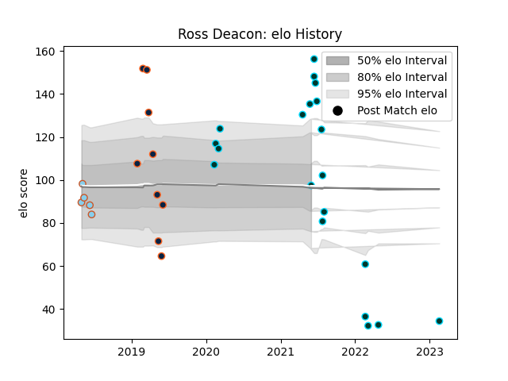

---  
layout: page  
title: Ross Deacon  
date: 2023-02-26 11:18:03.325555  
categories: player  
---
# Ross Deacon

## Positions: N8, FL

## Current elo: 97.0

## Current Percentile: 97.0

# Elo History

# Match History

| Team               |   Appearances |   Win Rate |
|:-------------------|--------------:|-----------:|
| Rugby ATL          |            20 |   0.55     |
| R.U. New York      |            10 |   0.7      |
| Rugby New York     |             9 |   0.555556 |
| Austin Elite Rugby |             5 |   0.2      |

| Opponent               |   Matches |   Win Rate |
|:-----------------------|----------:|-----------:|
| Houston SaberCats      |         6 |   0.833333 |
| San Diego Legion       |         6 |   0.333333 |
| NOLA Gold              |         5 |   1        |
| Seattle Seawolves      |         5 |   0.2      |
| Toronto Arrows         |         5 |   0.6      |
| R.U. New York          |         3 |   0.333333 |
| Rugby New York         |         3 |   0.333333 |
| Utah Warriors          |         3 |   0.666667 |
| Glendale Raptors       |         2 |   1        |
| L. A. Giltinis         |         2 |   0.5      |
| Old Glory DC           |         2 |   0.5      |
| Austin Gilgronis       |         1 |   0        |
| New England Free Jacks |         1 |   0        |