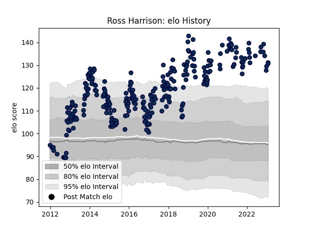

---  
layout: page  
title: Ross Harrison  
date: 2023-01-06 00:12:26.474304  
categories: player  
---
# Ross Harrison

## Positions: P

## Current elo: 120.0

## Current Percentile: 92.0

# Elo History

# Match History

| Team        |   Appearances |   Win Rate |
|:------------|--------------:|-----------:|
| Sale Sharks |           270 |   0.494444 |

| Opponent            |   Matches |   Win Rate |
|:--------------------|----------:|-----------:|
| Exeter Chiefs       |        22 |   0.272727 |
| Saracens            |        22 |   0.204545 |
| Harlequins          |        22 |   0.5      |
| Wasps               |        21 |   0.666667 |
| Northampton Saints  |        21 |   0.47619  |
| Leicester Tigers    |        20 |   0.4      |
| Gloucester Rugby    |        18 |   0.5      |
| Bath Rugby          |        17 |   0.5      |
| London Irish        |        16 |   0.71875  |
| Worcester Warriors  |        16 |   0.71875  |
| Newcastle Falcons   |        14 |   0.535714 |
| Bristol Rugby       |         8 |   0.6875   |
| Scarlets            |         6 |   0.833333 |
| Cardiff Blues       |         5 |   0.6      |
| Toulon              |         4 |   0        |
| London Welsh        |         4 |   0.75     |
| Connacht            |         3 |   0.666667 |
| La Rochelle         |         3 |   0.333333 |
| Montpellier Herault |         3 |   0        |
| Pau                 |         2 |   1        |
| Biarritz Olympique  |         2 |   1        |
| Stade Toulousain    |         2 |   0.25     |
| Bordeaux Begles     |         2 |   0.5      |
| Perpignan           |         2 |   1        |
| Dragons             |         2 |   0.5      |
| Oyonnax             |         2 |   0.5      |
| Glasgow Warriors    |         2 |   0        |
| Munster             |         2 |   0        |
| Lyon                |         2 |   0.5      |
| Clermont Auvergne   |         2 |   0        |
| Ospreys             |         1 |   0        |
| Castres Olympique   |         1 |   1        |
| Agen                |         1 |   1        |