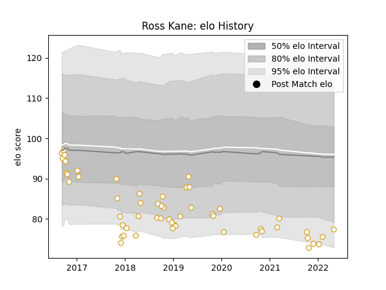

---  
layout: page  
title: Ross Kane  
date: 2023-01-13 11:26:45.599062  
categories: player  
---
# Ross Kane

## Positions: P

## Current elo: 77.0

## Current Percentile: None

# Elo History

# Match History

| Team   |   Appearances |   Win Rate |
|:-------|--------------:|-----------:|
| Ulster |            54 |   0.666667 |

| Opponent         |   Matches |   Win Rate |
|:-----------------|----------:|-----------:|
| Connacht         |         7 |   0.285714 |
| Cardiff Blues    |         4 |   0.75     |
| Edinburgh        |         4 |   0.75     |
| Munster          |         4 |   0.375    |
| Leinster         |         4 |   0.5      |
| Glasgow Warriors |         3 |   0.666667 |
| Ospreys          |         3 |   1        |
| Dragons          |         3 |   0.833333 |
| Scarlets         |         3 |   0.666667 |
| Benetton Treviso |         3 |   1        |
| Leicester Tigers |         2 |   1        |
| Zebre            |         2 |   1        |
| Harlequins       |         2 |   1        |
| Exeter Chiefs    |         2 |   0.5      |
| Racing 92        |         2 |   0.5      |
| Southern Kings   |         1 |   1        |
| Stade Toulousain |         1 |   0        |
| Bath Rugby       |         1 |   1        |
| Lions            |         1 |   1        |
| Bordeaux Begles  |         1 |   0        |
| La Rochelle      |         1 |   1        |