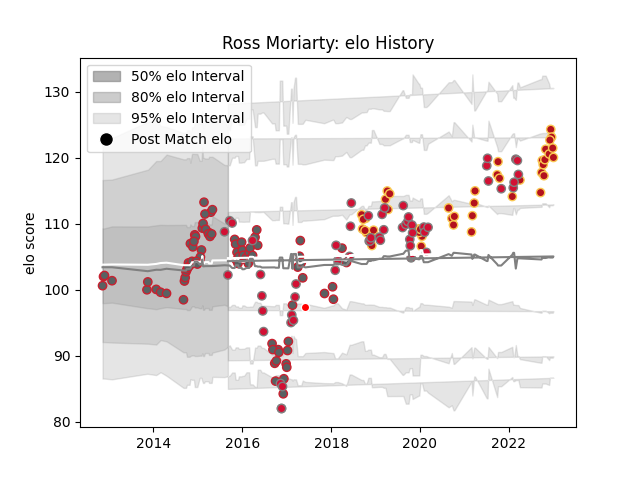

---  
layout: page  
title: Ross Moriarty  
date: 2023-01-06 00:09:03.862025  
categories: player  
---
# Ross Moriarty

## Positions: N8, FL

## Country: Wales

## Current elo: 102.0

## Current Percentile: 70.0

# Elo History

# Match History

| Team                    |   Appearances |   Win Rate |
|:------------------------|--------------:|-----------:|
| Gloucester Rugby        |            82 |   0.536585 |
| Wales                   |            56 |   0.544643 |
| Dragons                 |            43 |   0.372093 |
| British and Irish Lions |             1 |   1        |

| Opponent             |   Matches |   Win Rate |
|:---------------------|----------:|-----------:|
| Northampton Saints   |        10 |   0.05     |
| England              |         8 |   0.25     |
| Ospreys              |         8 |   0.5625   |
| Ireland              |         7 |   0.285714 |
| Zebre                |         7 |   0.857143 |
| Sale Sharks          |         6 |   0.833333 |
| Exeter Chiefs        |         6 |   0.416667 |
| Italy                |         6 |   0.833333 |
| France               |         5 |   0.4      |
| Newcastle Falcons    |         5 |   0.6      |
| Cardiff Blues        |         5 |   0.2      |
| New Zealand          |         5 |   0        |
| Argentina            |         5 |   0.7      |
| Scotland             |         5 |   0.8      |
| Bath Rugby           |         5 |   0.2      |
| Wasps                |         5 |   0.2      |
| Harlequins           |         5 |   0.3      |
| Australia            |         4 |   0.5      |
| Leinster             |         4 |   0        |
| Leicester Tigers     |         4 |   0.25     |
| La Rochelle          |         4 |   1        |
| Worcester Warriors   |         4 |   0.625    |
| Scarlets             |         4 |   0.5      |
| Benetton Treviso     |         4 |   0.625    |
| South Africa         |         4 |   0.75     |
| Saracens             |         4 |   0.25     |
| Edinburgh            |         3 |   0.666667 |
| London Welsh         |         3 |   1        |
| Sharks               |         2 |   0        |
| Southern Kings       |         2 |   0.75     |
| Pau                  |         2 |   0        |
| Oyonnax              |         2 |   1        |
| Stormers             |         2 |   0        |
| Uruguay              |         2 |   1        |
| Lions                |         2 |   0.25     |
| Bristol Rugby        |         2 |   0.5      |
| Brive                |         2 |   1        |
| Connacht             |         2 |   1        |
| London Irish         |         2 |   1        |
| Munster              |         1 |   1        |
| Stade Francais Paris |         1 |   0        |
| Canada               |         1 |   1        |
| Tonga                |         1 |   1        |
| Timisoara Saracens   |         1 |   1        |
| Castres Olympique    |         1 |   0        |
| Clermont Auvergne    |         1 |   0        |
| Cheetahs             |         1 |   0        |
| Fiji                 |         1 |   1        |
| Georgia              |         1 |   1        |
| Glasgow Warriors     |         1 |   1        |
| Japan                |         1 |   1        |
| RC Enisei            |         1 |   1        |
| Provincial Union XV  |         1 |   1        |
| Agen                 |         1 |   1        |