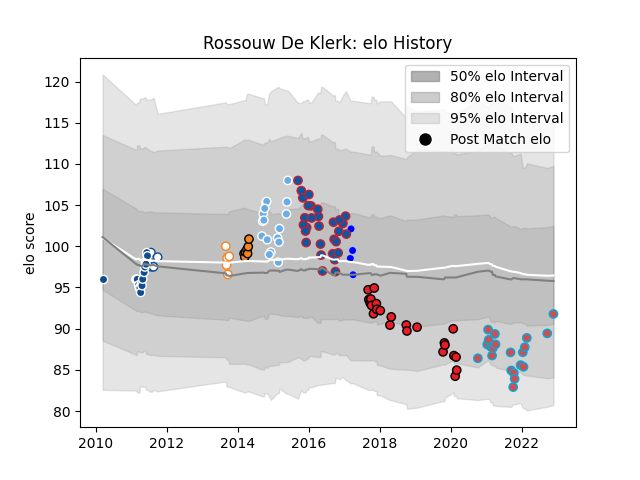

---  
layout: page  
title: Rossouw De Klerk  
date: 2022-11-22 11:42:15.198404  
categories: player  
---
# Rossouw De Klerk

## Positions: P

## Current elo: 92.0

## Current Percentile: 19.0

# Elo History

# Match History

| Team                |   Appearances |   Win Rate |
|:--------------------|--------------:|-----------:|
| Grenoble            |            30 |   0.366667 |
| Southern Kings      |            23 |   0        |
| Bourgoin-Jallieu    |            21 |   0.380952 |
| Bulls               |            17 |   0.647059 |
| Glasgow Warriors    |            17 |   0.823529 |
| Cheetahs            |             7 |   0.214286 |
| Blue Bulls          |             5 |   0.6      |
| Free State Cheetahs |             5 |   0.6      |
| Colomiers           |             4 |   0.5      |

| Opponent                   |   Matches |   Win Rate |
|:---------------------------|----------:|-----------:|
| Cheetahs                   |         6 |   0.333333 |
| Benetton Treviso           |         5 |   0.4      |
| Scarlets                   |         5 |   0        |
| Connacht                   |         4 |   0.5      |
| Ulster                     |         4 |   0.5      |
| Nice                       |         4 |   0.5      |
| Montpellier Herault        |         3 |   0.333333 |
| Munster                    |         3 |   0.333333 |
| Chambery                   |         3 |   0.666667 |
| Griquas                    |         3 |   1        |
| Zebre                      |         3 |   0.666667 |
| Sharks                     |         3 |   0.333333 |
| Edinburgh                  |         3 |   0.333333 |
| Stade Toulousain           |         3 |   0        |
| Stormers                   |         3 |   0.666667 |
| Bordeaux Begles            |         3 |   0        |
| Lions                      |         2 |   1        |
| Lyon                       |         2 |   0        |
| Albi                       |         2 |   0.5      |
| Massy                      |         2 |   0        |
| Hurricanes                 |         2 |   0.5      |
| Ospreys                    |         2 |   0.5      |
| Natal Sharks               |         2 |   0        |
| Oyonnax                    |         2 |   1        |
| Queensland Reds            |         2 |   0        |
| Soyaux-Angouleme           |         2 |   0.5      |
| Tarbes                     |         2 |   0        |
| Toulon                     |         2 |   0.5      |
| Highlanders                |         2 |   0.5      |
| Agen                       |         2 |   1        |
| Glasgow Warriors           |         2 |   0        |
| Dragons                    |         2 |   0.5      |
| Aubenas                    |         2 |   0.5      |
| Cardiff Blues              |         2 |   0.5      |
| Dax                        |         2 |   0        |
| Castres Olympique          |         2 |   0        |
| Crusaders                  |         2 |   0        |
| Brive                      |         2 |   0.5      |
| Chiefs                     |         2 |   0.75     |
| Golden Lions               |         1 |   1        |
| Stade Francais Paris       |         1 |   0        |
| Blue Bulls                 |         1 |   0        |
| Bath Rugby                 |         1 |   1        |
| Beziers                    |         1 |   0        |
| Bayonne                    |         1 |   1        |
| Aurillac                   |         1 |   1        |
| US Bressane                |         1 |   0        |
| Western Force              |         1 |   0        |
| Western Province           |         1 |   0        |
| Blues                      |         1 |   0        |
| Pau                        |         1 |   0        |
| Racing 92                  |         1 |   0        |
| Carcassonne                |         1 |   0        |
| Pumas                      |         1 |   1        |
| Newcastle Falcons          |         1 |   1        |
| New South Wales Waratahs   |         1 |   1        |
| Clermont Auvergne          |         1 |   0        |
| Cognac Saint Jean d'Angély |         1 |   1        |
| Melbourne Rebels           |         1 |   1        |
| Dijon                      |         1 |   1        |
| London Irish               |         1 |   1        |
| Leinster                   |         1 |   1        |
| Free State Cheetahs        |         1 |   1        |
| La Rochelle                |         1 |   0        |