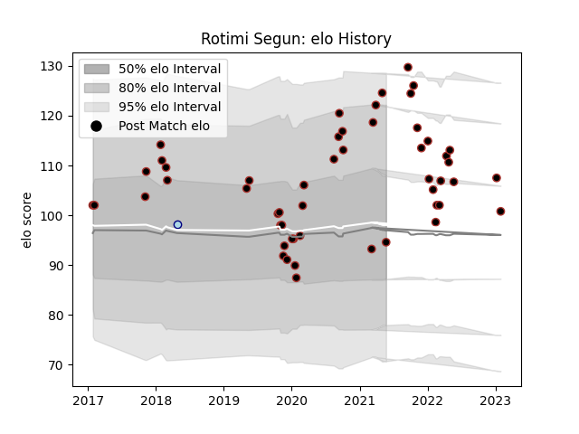

---  
layout: page  
title: Rotimi Segun  
date: 2023-01-05 11:28:43.536822  
categories: player  
---
# Rotimi Segun

## Positions: W

## Current elo: 95.0

## Current Percentile: 89.0

# Elo History

# Match History

| Team     |   Appearances |   Win Rate |
|:---------|--------------:|-----------:|
| Saracens |            50 |       0.62 |
| Bedford  |             1 |       0    |

| Opponent           |   Matches |   Win Rate |
|:-------------------|----------:|-----------:|
| Leicester Tigers   |         6 |   0.666667 |
| Exeter Chiefs      |         5 |   0.6      |
| Worcester Warriors |         4 |   0.5      |
| Sale Sharks        |         4 |   0.5      |
| Northampton Saints |         4 |   0.75     |
| Harlequins         |         3 |   0.333333 |
| London Irish       |         3 |   0.5      |
| Gloucester Rugby   |         2 |   0.5      |
| Bristol Rugby      |         2 |   0.5      |
| Nottingham         |         2 |   0.5      |
| Ospreys            |         2 |   1        |
| Racing 92          |         2 |   0.5      |
| Bath Rugby         |         2 |   0.75     |
| Dragons            |         1 |   1        |
| Jersey             |         1 |   1        |
| Coventry           |         1 |   1        |
| Munster            |         1 |   0        |
| Newcastle Falcons  |         1 |   1        |
| Cornish Pirates    |         1 |   0        |
| Richmond           |         1 |   1        |
| Brive              |         1 |   1        |
| Scarlets           |         1 |   1        |
| Wasps              |         1 |   0        |