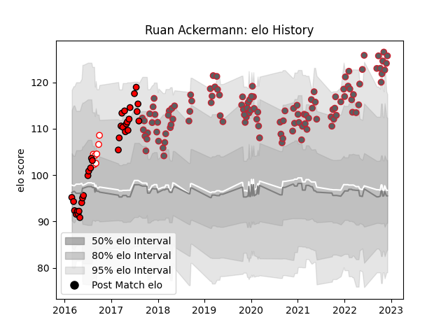

---  
layout: page  
title: Ruan Ackermann  
date: 2023-01-06 00:25:57.839634  
categories: player  
---
# Ruan Ackermann

## Positions: N8, FL

## Current elo: 103.0

## Current Percentile: 75.0

# Elo History

# Match History

| Team             |   Appearances |   Win Rate |
|:-----------------|--------------:|-----------:|
| Gloucester Rugby |           117 |   0.5      |
| Lions            |            33 |   0.848485 |
| Golden Lions     |             8 |   0.625    |

| Opponent                 |   Matches |   Win Rate |
|:-------------------------|----------:|-----------:|
| Bath Rugby               |        10 |   0.65     |
| Northampton Saints       |        10 |   0.6      |
| London Irish             |        10 |   0.75     |
| Exeter Chiefs            |        10 |   0.4      |
| Wasps                    |         9 |   0.611111 |
| Newcastle Falcons        |         9 |   0.666667 |
| Leicester Tigers         |         9 |   0.222222 |
| Sale Sharks              |         9 |   0.333333 |
| Bristol Rugby            |         8 |   0.375    |
| Saracens                 |         8 |   0.5      |
| Harlequins               |         8 |   0.25     |
| Worcester Warriors       |         7 |   0.714286 |
| Sharks                   |         5 |   1        |
| Southern Kings           |         4 |   1        |
| Crusaders                |         3 |   0.333333 |
| Hurricanes               |         3 |   0.333333 |
| Connacht                 |         3 |   0.666667 |
| Cheetahs                 |         2 |   1        |
| Montpellier Herault      |         2 |   0.5      |
| Jaguares                 |         2 |   1        |
| Highlanders              |         2 |   0.5      |
| Stormers                 |         2 |   1        |
| Bulls                    |         2 |   1        |
| Sunwolves                |         2 |   1        |
| Stade Toulousain         |         2 |   0        |
| Western Force            |         1 |   1        |
| Queensland Reds          |         1 |   1        |
| Western Province         |         1 |   1        |
| Melbourne Rebels         |         1 |   1        |
| Pumas                    |         1 |   1        |
| Pau                      |         1 |   0        |
| New South Wales Waratahs |         1 |   1        |
| Natal Sharks             |         1 |   1        |
| Blue Bulls               |         1 |   0        |
| Griquas                  |         1 |   0        |
| Free State Cheetahs      |         1 |   0        |
| Eastern Province Kings   |         1 |   1        |
| Cardiff Blues            |         1 |   0        |
| Brumbies                 |         1 |   1        |
| Boland Cavaliers         |         1 |   1        |
| Blues                    |         1 |   1        |
| Zebre                    |         1 |   1        |