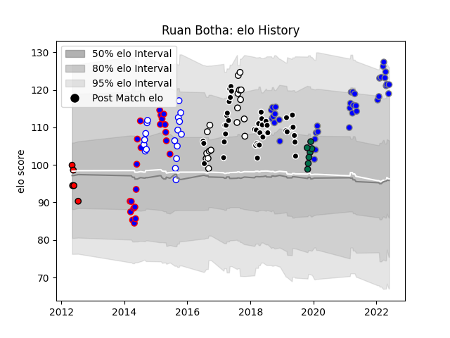

---  
layout: page  
title: Ruan Botha  
date: 2023-01-13 11:31:16.376973  
categories: player  
---
# Ruan Botha

## Positions: L

## Current elo: 124.0

## Current Percentile: 93.0

# Elo History

# Match History

| Team                              |   Appearances |   Win Rate |
|:----------------------------------|--------------:|-----------:|
| Sharks                            |            42 |   0.559524 |
| Kubota Spears Funabashi Tokyo-Bay |            26 |   0.788462 |
| Stormers                          |            22 |   0.5      |
| Western Province                  |            18 |   0.722222 |
| Natal Sharks                      |            16 |   0.8125   |
| London Irish                      |             7 |   0.5      |
| Lions                             |             5 |   0        |

| Opponent                        |   Matches |   Win Rate |
|:--------------------------------|----------:|-----------:|
| Blue Bulls                      |         7 |   0.857143 |
| Lions                           |         7 |   0.571429 |
| Bulls                           |         7 |   0.428571 |
| Griquas                         |         6 |   1        |
| Golden Lions                    |         6 |   0.333333 |
| Pumas                           |         5 |   1        |
| Jaguares                        |         5 |   0.6      |
| Cheetahs                        |         5 |   0.6      |
| Chiefs                          |         5 |   0.2      |
| New South Wales Waratahs        |         4 |   0.625    |
| Stormers                        |         4 |   0.5      |
| Sunwolves                       |         4 |   1        |
| Yokohama Canon Eagles           |         4 |   0.625    |
| Western Force                   |         4 |   0.75     |
| Blues                           |         4 |   0.75     |
| Free State Cheetahs             |         4 |   0.5      |
| Crusaders                       |         3 |   0.166667 |
| Urayasu D-Rocks                 |         3 |   1        |
| Brumbies                        |         3 |   0.333333 |
| Hurricanes                      |         3 |   0        |
| Sharks                          |         3 |   0.333333 |
| Toyota Verblitz                 |         2 |   0.5      |
| Toshiba Brave Lupus Tokyo       |         2 |   1        |
| Southern Kings                  |         2 |   0.5      |
| Western Province                |         2 |   0.5      |
| Saitama Wild Knights            |         2 |   0        |
| Queensland Reds                 |         2 |   0        |
| Melbourne Rebels                |         2 |   0.25     |
| Highlanders                     |         2 |   1        |
| Mie Honda Heat                  |         2 |   1        |
| Eastern Province Kings          |         2 |   1        |
| Green Rockets Tokatsu           |         2 |   1        |
| Hanazono Kintetsu Liners        |         1 |   1        |
| Boland Cavaliers                |         1 |   1        |
| Bristol Rugby                   |         1 |   0.5      |
| Wasps                           |         1 |   1        |
| Coca-Cola Red Sparks            |         1 |   1        |
| Toulon                          |         1 |   0        |
| Tokyo Sungoliath                |         1 |   1        |
| NTT Docomo Red Hurricanes Osaka |         1 |   1        |
| Natal Sharks                    |         1 |   1        |
| Hino Red Dolphins               |         1 |   1        |
| Shizuoka Blue Revs              |         1 |   0        |
| Kobelco Kobe Steelers           |         1 |   1        |
| Saracens                        |         1 |   0        |
| Sale Sharks                     |         1 |   0        |
| Leicester Tigers                |         1 |   1        |
| Black Rams Tokyo                |         1 |   1        |
| Munakata Sanix Blues            |         1 |   1        |
| Bayonne                         |         1 |   1        |