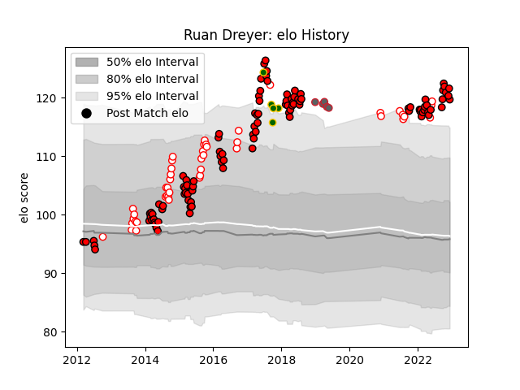

---  
layout: page  
title: Ruan Dreyer  
date: 2022-12-14 11:32:19.544546  
categories: player  
---
# Ruan Dreyer

## Positions: P

## Country: South Africa

## Current elo: 120.0

## Current Percentile: 97.0

# Elo History

# Match History

| Team             |   Appearances |   Win Rate |
|:-----------------|--------------:|-----------:|
| Lions            |           104 |   0.586538 |
| Golden Lions     |            44 |   0.704545 |
| Gloucester Rugby |             5 |   0.6      |
| South Africa     |             5 |   0.3      |

| Opponent                 |   Matches |   Win Rate |
|:-------------------------|----------:|-----------:|
| Sharks                   |        13 |   0.461538 |
| Western Province         |        12 |   0.708333 |
| Bulls                    |        11 |   0.454545 |
| Stormers                 |        11 |   0.5      |
| Natal Sharks             |         8 |   0.625    |
| Cheetahs                 |         7 |   0.857143 |
| Blue Bulls               |         7 |   0.571429 |
| Crusaders                |         6 |   0        |
| Free State Cheetahs      |         6 |   0.583333 |
| Pumas                    |         5 |   0.8      |
| New South Wales Waratahs |         5 |   0.8      |
| Jaguares                 |         5 |   0.6      |
| Queensland Reds          |         4 |   0.75     |
| Melbourne Rebels         |         4 |   1        |
| Southern Kings           |         3 |   1        |
| Highlanders              |         3 |   0.333333 |
| Hurricanes               |         3 |   0.333333 |
| Griquas                  |         3 |   1        |
| Eastern Province Kings   |         3 |   1        |
| Dragons                  |         3 |   0.833333 |
| Brumbies                 |         3 |   0.666667 |
| Blues                    |         3 |   0.666667 |
| Scarlets                 |         2 |   0.5      |
| Western Force            |         2 |   0.5      |
| Ulster                   |         2 |   0        |
| New Zealand              |         2 |   0        |
| Sunwolves                |         2 |   1        |
| Chiefs                   |         2 |   0.5      |
| Ospreys                  |         2 |   1        |
| Cardiff Blues            |         2 |   1        |
| Wasps                    |         1 |   1        |
| Wales                    |         1 |   0        |
| Australia                |         1 |   0.5      |
| Munster                  |         1 |   1        |
| Saracens                 |         1 |   0        |
| Sale Sharks              |         1 |   0        |
| Northampton Saints       |         1 |   1        |
| Newcastle Falcons        |         1 |   1        |
| Benetton Treviso         |         1 |   1        |
| Leinster                 |         1 |   0        |
| France                   |         1 |   1        |
| Edinburgh                |         1 |   1        |
| Connacht                 |         1 |   0        |
| Zebre                    |         1 |   1        |