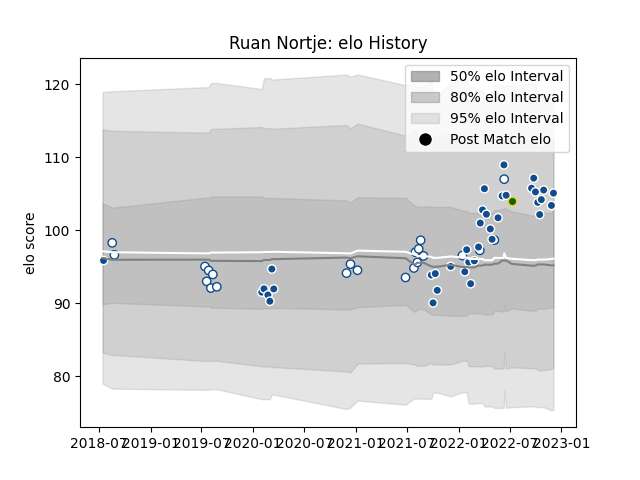

---  
layout: page  
title: Ruan Nortje  
date: 2023-02-02 18:56:21.804971  
categories: player  
---
# Ruan Nortje

## Positions: L

## Country: South Africa

## Current elo: 103.0

## Current Percentile: 83.0

# Elo History

# Match History

| Team         |   Appearances |   Win Rate |
|:-------------|--------------:|-----------:|
| Bulls        |            43 |   0.534884 |
| Blue Bulls   |            26 |   0.653846 |
| South Africa |             1 |   0        |

| Opponent            |   Matches |   Win Rate |
|:--------------------|----------:|-----------:|
| Sharks              |         6 |   0.333333 |
| Stormers            |         5 |   0        |
| Pumas               |         5 |   1        |
| Free State Cheetahs |         5 |   0.6      |
| Golden Lions        |         5 |   0.8      |
| Natal Sharks        |         5 |   0.2      |
| Lions               |         4 |   0.75     |
| Western Province    |         3 |   0.666667 |
| Griquas             |         3 |   0.666667 |
| Leinster            |         2 |   0.5      |
| Scarlets            |         2 |   0.5      |
| Ospreys             |         2 |   1        |
| Munster             |         2 |   0.5      |
| Benetton Treviso    |         2 |   1        |
| Glasgow Warriors    |         2 |   0.5      |
| Edinburgh           |         2 |   0.5      |
| Dragons             |         2 |   1        |
| Connacht            |         2 |   0.5      |
| Cardiff Blues       |         2 |   1        |
| Blues               |         1 |   0        |
| Lyon                |         1 |   0        |
| Jaguares            |         1 |   0        |
| Highlanders         |         1 |   1        |
| Exeter Chiefs       |         1 |   1        |
| Queensland Reds     |         1 |   0        |
| Ulster              |         1 |   1        |
| Wales               |         1 |   0        |
| Zebre               |         1 |   1        |