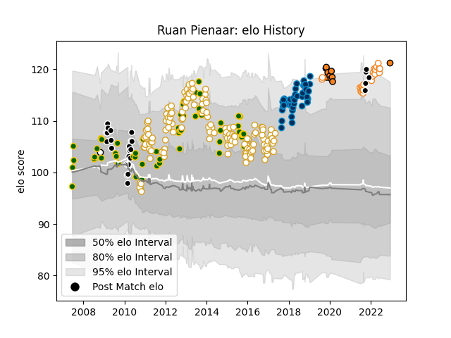

---  
layout: page  
title: Ruan Pienaar  
date: 2023-03-21 18:54:50.027839  
categories: player  
---
# Ruan Pienaar

Last updated: 2023-03-21
## Positions: SH, FH

## Country: South Africa

## Current elo: 104.0

## Current Percentile: 96.0

# Elo History

# Match History

| Team                |   Appearances |   Win Rate |
|:--------------------|--------------:|-----------:|
| Ulster              |           138 |   0.67029  |
| South Africa        |            83 |   0.674699 |
| Sharks              |            65 |   0.576923 |
| Montpellier Herault |            40 |   0.5375   |
| Free State Cheetahs |            27 |   0.611111 |
| Cheetahs            |            14 |   0.5      |
| Natal Sharks        |             5 |   0.6      |
| Munster             |             1 |   1        |

| Opponent                 |   Matches |   Win Rate |
|:-------------------------|----------:|-----------:|
| Leinster                 |        20 |   0.25     |
| New Zealand              |        17 |   0.235294 |
| Australia                |        16 |   0.5      |
| Scarlets                 |        15 |   0.6      |
| Glasgow Warriors         |        13 |   0.615385 |
| Edinburgh                |        11 |   0.727273 |
| Argentina                |        10 |   0.85     |
| Munster                  |        10 |   0.45     |
| Benetton Treviso         |        10 |   0.95     |
| Cardiff Blues            |        10 |   0.55     |
| Dragons                  |        10 |   0.9      |
| Ospreys                  |         9 |   0.666667 |
| England                  |         9 |   0.833333 |
| Connacht                 |         8 |   0.75     |
| Wales                    |         8 |   1        |
| Zebre                    |         7 |   0.857143 |
| Scotland                 |         6 |   0.833333 |
| Queensland Reds          |         6 |   0.666667 |
| Toulon                   |         6 |   0.5      |
| Pumas                    |         6 |   0.5      |
| Castres Olympique        |         6 |   0.666667 |
| Highlanders              |         6 |   0.833333 |
| Bulls                    |         6 |   0.333333 |
| Chiefs                   |         6 |   0.5      |
| Aironi                   |         6 |   1        |
| Blues                    |         5 |   1        |
| Golden Lions             |         5 |   0.7      |
| Italy                    |         5 |   1        |
| Western Province         |         5 |   0.8      |
| Stormers                 |         5 |   1        |
| Natal Sharks             |         5 |   0.6      |
| Crusaders                |         5 |   0.2      |
| Clermont Auvergne        |         5 |   0.4      |
| Blue Bulls               |         4 |   0.75     |
| Leicester Tigers         |         4 |   1        |
| Cheetahs                 |         4 |   0.5      |
| Saracens                 |         4 |   0        |
| Griquas                  |         4 |   0.5      |
| Bordeaux Begles          |         4 |   0.375    |
| Brumbies                 |         4 |   0.25     |
| Stade Toulousain         |         4 |   0.75     |
| New South Wales Waratahs |         4 |   0        |
| Samoa                    |         3 |   1        |
| Northampton Saints       |         3 |   0.333333 |
| Western Force            |         3 |   0.666667 |
| Agen                     |         3 |   0.666667 |
| Free State Cheetahs      |         3 |   0.333333 |
| Hurricanes               |         3 |   0.833333 |
| Lions                    |         3 |   1        |
| Ireland                  |         3 |   0.666667 |
| Exeter Chiefs            |         2 |   0.5      |
| Stade Francais Paris     |         2 |   0        |
| Southern Kings           |         2 |   1        |
| France                   |         2 |   1        |
| Montpellier Herault      |         2 |   1        |
| Biarritz Olympique       |         2 |   0.5      |
| Racing 92                |         2 |   0.5      |
| La Rochelle              |         2 |   1        |
| Bath Rugby               |         2 |   1        |
| Pau                      |         2 |   1        |
| Oyonnax                  |         2 |   1        |
| Lyon                     |         2 |   0.5      |
| Newcastle Falcons        |         2 |   0.5      |
| Ulster                   |         2 |   0.5      |
| Cats                     |         1 |   1        |
| Brive                    |         1 |   1        |
| Namibia                  |         1 |   1        |
| Tonga                    |         1 |   1        |
| Fiji                     |         1 |   1        |
| Grenoble                 |         1 |   0        |
| Perpignan                |         1 |   1        |
| Japan                    |         1 |   0        |