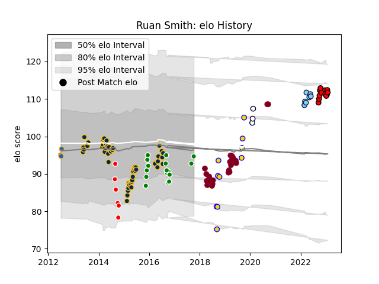

---  
layout: page  
title: Ruan Smith  
date: 2023-02-02 18:56:07.651658  
categories: player  
---
# Ruan Smith

## Positions: P

## Current elo: 95.0

## Current Percentile: 27.0

# Elo History

# Match History

| Team                     |   Appearances |   Win Rate |
|:-------------------------|--------------:|-----------:|
| Brumbies                 |            53 |   0.603774 |
| Queensland Reds          |            29 |   0.37931  |
| Toyota Verblitz          |            16 |   0.6875   |
| Lions                    |            12 |   0.416667 |
| Brisbane City            |            10 |   0.45     |
| New South Wales Waratahs |             7 |   0.428571 |
| Canberra Vikings         |             6 |   0.416667 |
| Melbourne Rebels         |             3 |   0.333333 |
| Western Force            |             3 |   0        |

| Opponent                          |   Matches |   Win Rate |
|:----------------------------------|----------:|-----------:|
| New South Wales Waratahs          |        11 |   0.181818 |
| Melbourne Rebels                  |        10 |   0.6      |
| Western Force                     |         8 |   0.625    |
| Brumbies                          |         8 |   0.25     |
| Blues                             |         8 |   0.375    |
| Queensland Reds                   |         7 |   0.571429 |
| Bulls                             |         6 |   0.5      |
| Highlanders                       |         6 |   0.333333 |
| Chiefs                            |         6 |   0.333333 |
| Stormers                          |         5 |   0.6      |
| Sunwolves                         |         5 |   0.8      |
| Crusaders                         |         4 |   0        |
| Cheetahs                          |         4 |   0.75     |
| Hurricanes                        |         4 |   0.5      |
| Sharks                            |         3 |   0.666667 |
| Lions                             |         2 |   1        |
| Stade Francais Paris              |         2 |   0.5      |
| Queensland Country                |         2 |   1        |
| Sydney Rays                       |         2 |   1        |
| Toyota Industries Shuttles Aichi  |         2 |   1        |
| Yokohama Canon Eagles             |         2 |   0.5      |
| Fijian Drua                       |         2 |   0.25     |
| Jaguares                          |         2 |   0.5      |
| Canberra Vikings                  |         2 |   0        |
| Coca-Cola Red Sparks              |         2 |   1        |
| Green Rockets Tokatsu             |         2 |   0.5      |
| Kobelco Kobe Steelers             |         1 |   0        |
| Brisbane City                     |         1 |   0        |
| Urayasu D-Rocks                   |         1 |   0        |
| Ulster                            |         1 |   0        |
| Cardiff Blues                     |         1 |   1        |
| Connacht                          |         1 |   0        |
| Dragons                           |         1 |   1        |
| Shizuoka Blue Revs                |         1 |   0        |
| Edinburgh                         |         1 |   1        |
| Perth Spirit                      |         1 |   0        |
| Greater Sydney Rams               |         1 |   1        |
| Kubota Spears Funabashi Tokyo-Bay |         1 |   1        |
| Ospreys                           |         1 |   1        |
| North Harbour Rays                |         1 |   0.5      |
| NTT Docomo Red Hurricanes Osaka   |         1 |   1        |
| NSW Country Eagles                |         1 |   0        |
| Munster                           |         1 |   0        |
| Moana Pasifika                    |         1 |   1        |
| Mie Honda Heat                    |         1 |   1        |
| Melbourne Rising                  |         1 |   1        |
| Hanazono Kintetsu Liners          |         1 |   1        |
| Black Rams Tokyo                  |         1 |   1        |