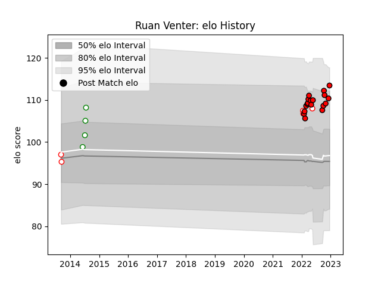

---  
layout: page  
title: Ruan Venter  
date: 2022-12-14 11:31:59.767343  
categories: player  
---
# Ruan Venter

## Positions: L, FL

## Current elo: 110.0

## Current Percentile: 86.0

# Elo History

# Match History

| Team         |   Appearances |   Win Rate |
|:-------------|--------------:|-----------:|
| Lions        |            17 |   0.529412 |
| Golden Lions |             5 |   0.2      |
| Leopards     |             4 |   1        |

| Opponent            |   Matches |   Win Rate |
|:--------------------|----------:|-----------:|
| Bulls               |         3 |          0 |
| Stormers            |         2 |          0 |
| Cardiff Blues       |         2 |          1 |
| Edinburgh           |         2 |          1 |
| Benetton Treviso    |         1 |          1 |
| Leinster            |         1 |          0 |
| Ulster              |         1 |          0 |
| Scarlets            |         1 |          1 |
| SWD Eagles          |         1 |          1 |
| Pumas               |         1 |          0 |
| Ospreys             |         1 |          1 |
| Munster             |         1 |          1 |
| Griffons            |         1 |          1 |
| Griquas             |         1 |          1 |
| Blue Bulls          |         1 |          0 |
| Free State Cheetahs |         1 |          0 |
| Dragons             |         1 |          1 |
| Connacht            |         1 |          0 |
| Border Bulldogs     |         1 |          1 |
| Boland Cavaliers    |         1 |          1 |
| Western Province    |         1 |          0 |