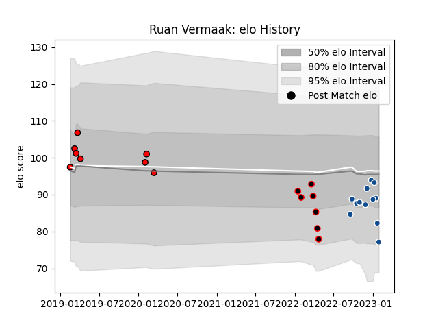

---  
layout: page  
title: Ruan Vermaak  
date: 2023-03-21 18:17:19.243840  
categories: player  
---
# Ruan Vermaak

Last updated: 2023-03-21
## Positions: L, FL

## Current elo: 105.0

## Current Percentile: 66.0

# Elo History

# Match History

| Team                            |   Appearances |   Win Rate |
|:--------------------------------|--------------:|-----------:|
| Lions                           |             8 |   0.625    |
| NTT Docomo Red Hurricanes Osaka |             7 |   0.142857 |
| Bulls                           |             6 |   0.833333 |

| Opponent                          |   Matches |   Win Rate |
|:----------------------------------|----------:|-----------:|
| Jaguares                          |         3 |   0.666667 |
| Toshiba Brave Lupus Tokyo         |         2 |   0        |
| Sharks                            |         2 |   0.5      |
| Blues                             |         1 |   0        |
| Ospreys                           |         1 |   1        |
| Tokyo Sungoliath                  |         1 |   0        |
| Sunwolves                         |         1 |   1        |
| Shizuoka Blue Revs                |         1 |   0        |
| Queensland Reds                   |         1 |   1        |
| Munster                           |         1 |   0        |
| Cardiff Blues                     |         1 |   1        |
| Melbourne Rebels                  |         1 |   1        |
| Lions                             |         1 |   1        |
| Kubota Spears Funabashi Tokyo-Bay |         1 |   0        |
| Green Rockets Tokatsu             |         1 |   1        |
| Edinburgh                         |         1 |   1        |
| Toyota Verblitz                   |         1 |   0        |