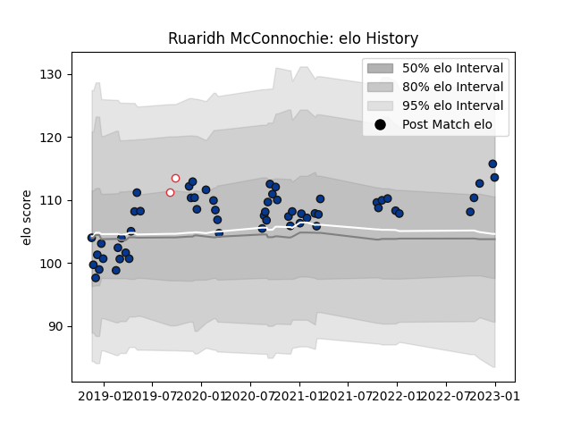

---  
layout: page  
title: Ruaridh McConnochie  
date: 2022-12-28 12:57:06.790935  
categories: player  
---
# Ruaridh McConnochie

## Positions: W

## Country: England

## Current elo: 108.0

## Current Percentile: 82.0

# Elo History

# Match History

| Team       |   Appearances |   Win Rate |
|:-----------|--------------:|-----------:|
| Bath Rugby |            56 |   0.410714 |
| England    |             2 |   1        |

| Opponent                 |   Matches |   Win Rate |
|:-------------------------|----------:|-----------:|
| Exeter Chiefs            |         7 |   0        |
| Worcester Warriors       |         5 |   1        |
| Newcastle Falcons        |         5 |   0.6      |
| Harlequins               |         5 |   0.4      |
| Saracens                 |         5 |   0.3      |
| Leicester Tigers         |         5 |   0.6      |
| Wasps                    |         4 |   0.5      |
| Sale Sharks              |         3 |   0.5      |
| Northampton Saints       |         3 |   0.666667 |
| Bristol Rugby            |         3 |   0.333333 |
| Gloucester Rugby         |         3 |   0.333333 |
| Clermont Auvergne        |         2 |   0        |
| Leinster                 |         2 |   0        |
| Ulster                   |         2 |   0        |
| London Irish             |         2 |   0.5      |
| Italy                    |         1 |   1        |
| United States of America |         1 |   1        |