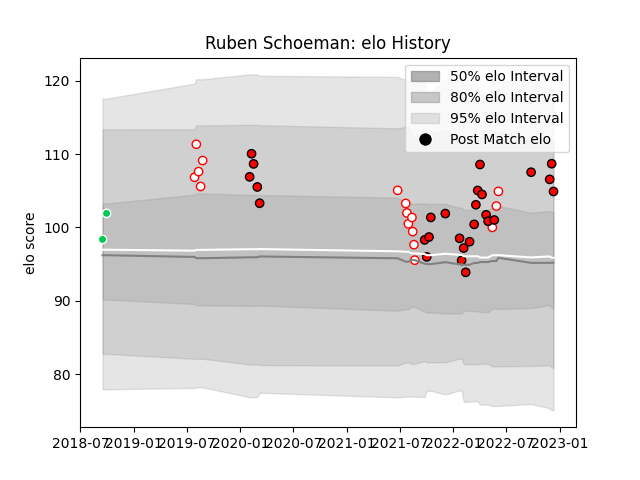

---  
layout: page  
title: Ruben Schoeman  
date: 2022-12-18 16:29:19.655481  
categories: player  
---
# Ruben Schoeman

## Positions: L

## Current elo: 105.0

## Current Percentile: 85.0

# Elo History

# Match History

| Team         |   Appearances |   Win Rate |
|:-------------|--------------:|-----------:|
| Lions        |            27 |   0.462963 |
| Golden Lions |            16 |   0.40625  |
| SWD Eagles   |             2 |   1        |

| Opponent                 |   Matches |   Win Rate |
|:-------------------------|----------:|-----------:|
| Western Province         |         4 |   0.75     |
| Blue Bulls               |         4 |   0        |
| Dragons                  |         3 |   0.833333 |
| Stormers                 |         3 |   0.333333 |
| Natal Sharks             |         3 |   0.333333 |
| Ospreys                  |         2 |   1        |
| Bulls                    |         2 |   0        |
| Free State Cheetahs      |         2 |   0.75     |
| Sharks                   |         2 |   0        |
| Griquas                  |         2 |   0.5      |
| Scarlets                 |         2 |   0.5      |
| Benetton Treviso         |         1 |   1        |
| Valke                    |         1 |   1        |
| Ulster                   |         1 |   0        |
| Queensland Reds          |         1 |   1        |
| Pumas                    |         1 |   0        |
| Melbourne Rebels         |         1 |   0        |
| New South Wales Waratahs |         1 |   0        |
| Munster                  |         1 |   1        |
| Leinster                 |         1 |   0        |
| Jaguares                 |         1 |   0        |
| Glasgow Warriors         |         1 |   0        |
| Edinburgh                |         1 |   1        |
| Connacht                 |         1 |   0        |
| Cardiff Blues            |         1 |   1        |
| Boland Cavaliers         |         1 |   1        |
| Zebre                    |         1 |   1        |