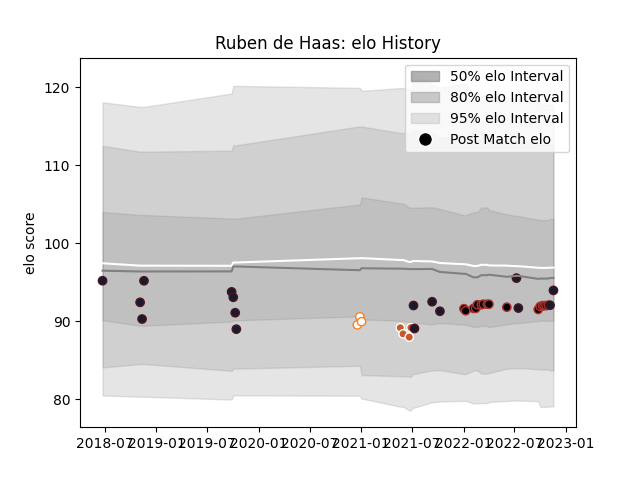

---  
layout: page  
title: Ruben de Haas  
date: 2022-11-22 11:46:22.154682  
categories: player  
---
# Ruben de Haas

## Positions: SH

## Country: United States of America

## Current elo: 94.0

## Current Percentile: 32.0

# Elo History

# Match History

| Team                     |   Appearances |   Win Rate |
|:-------------------------|--------------:|-----------:|
| Saracens                 |            16 |   0.8125   |
| United States of America |            16 |   0.40625  |
| Austin Gilgronis         |             4 |   0.5      |
| Free State Cheetahs      |             3 |   0.666667 |

| Opponent           |   Matches |   Win Rate |
|:-------------------|----------:|-----------:|
| Gloucester Rugby   |         3 |   0.333333 |
| Newcastle Falcons  |         2 |   1        |
| Canada             |         2 |   1        |
| Chile              |         2 |   0.5      |
| England            |         2 |   0        |
| Bath Rugby         |         2 |   1        |
| Leicester Tigers   |         2 |   1        |
| Sale Sharks        |         2 |   1        |
| Samoa              |         1 |   1        |
| Pumas              |         1 |   1        |
| Romania            |         1 |   1        |
| Argentina          |         1 |   0        |
| San Diego Legion   |         1 |   1        |
| Portugal           |         1 |   0.5      |
| Tonga              |         1 |   0        |
| Uruguay            |         1 |   0        |
| Utah Warriors      |         1 |   0        |
| Seattle Seawolves  |         1 |   1        |
| Natal Sharks       |         1 |   1        |
| Northampton Saints |         1 |   1        |
| New Zealand Maori  |         1 |   0        |
| London Irish       |         1 |   0        |
| L. A. Giltinis     |         1 |   0        |
| Kenya              |         1 |   1        |
| Ireland            |         1 |   0        |
| Harlequins         |         1 |   1        |
| France             |         1 |   0        |
| Exeter Chiefs      |         1 |   1        |
| Bristol Rugby      |         1 |   1        |
| Western Province   |         1 |   0        |