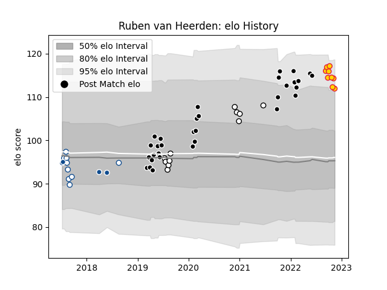

---  
layout: page  
title: Ruben van Heerden  
date: 2022-12-18 16:18:48.903854  
categories: player  
---
# Ruben van Heerden

## Positions: L

## Current elo: 110.0

## Current Percentile: 85.0

# Elo History

# Match History

| Team          |   Appearances |   Win Rate |
|:--------------|--------------:|-----------:|
| Sharks        |            32 |   0.53125  |
| Exeter Chiefs |            12 |   0.583333 |
| Natal Sharks  |            11 |   0.727273 |
| Blue Bulls    |             9 |   0.444444 |
| Bulls         |             4 |   0.25     |

| Opponent                 |   Matches |   Win Rate |
|:-------------------------|----------:|-----------:|
| Bulls                    |         7 |   0.571429 |
| Stormers                 |         6 |   0.583333 |
| Griquas                  |         5 |   0.8      |
| Free State Cheetahs      |         4 |   0.5      |
| Lions                    |         3 |   1        |
| Jaguares                 |         3 |   0.333333 |
| Pumas                    |         3 |   0.333333 |
| Golden Lions             |         3 |   0.666667 |
| Queensland Reds          |         2 |   0.5      |
| Brumbies                 |         2 |   0        |
| Hurricanes               |         2 |   0        |
| Western Province         |         2 |   0.5      |
| Blue Bulls               |         2 |   1        |
| Melbourne Rebels         |         2 |   1        |
| Southern Kings           |         1 |   0        |
| Saracens                 |         1 |   0        |
| Sale Sharks              |         1 |   0        |
| New South Wales Waratahs |         1 |   1        |
| Ulster                   |         1 |   0        |
| Ospreys                  |         1 |   1        |
| Northampton Saints       |         1 |   0        |
| Newcastle Falcons        |         1 |   0        |
| Benetton Treviso         |         1 |   1        |
| Natal Sharks             |         1 |   0        |
| Munster                  |         1 |   0        |
| London Irish             |         1 |   1        |
| Leicester Tigers         |         1 |   1        |
| Highlanders              |         1 |   1        |
| Harlequins               |         1 |   1        |
| Gloucester Rugby         |         1 |   0        |
| Glasgow Warriors         |         1 |   0        |
| Crusaders                |         1 |   0.5      |
| Castres Olympique        |         1 |   1        |
| Cardiff Blues            |         1 |   0        |
| Bristol Rugby            |         1 |   1        |
| Worcester Warriors       |         1 |   1        |