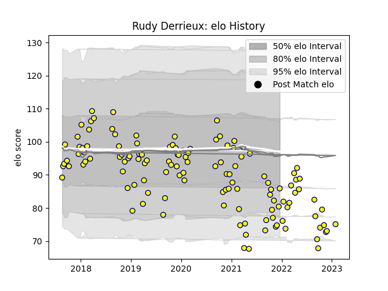

---  
layout: page  
title: Rudy Derrieux  
date: 2022-11-22 11:29:45.995052  
categories: player  
---
# Rudy Derrieux

## Positions: C

## Current elo: 83.0

## Current Percentile: 8.0

# Elo History

# Match History

| Team   |   Appearances |   Win Rate |
|:-------|--------------:|-----------:|
| Nevers |            95 |   0.515789 |

| Opponent                   |   Matches |   Win Rate |
|:---------------------------|----------:|-----------:|
| Aurillac                   |         8 |   0.625    |
| Mont-de-Marsan             |         6 |   0.5      |
| Grenoble                   |         6 |   0.25     |
| Provence Rugby             |         6 |   0.5      |
| Montauban                  |         6 |   0.333333 |
| Vannes                     |         6 |   0.333333 |
| Carcassonne                |         5 |   0.6      |
| Beziers                    |         5 |   0.8      |
| Soyaux-Angouleme           |         5 |   0.6      |
| Rouen                      |         5 |   0.8      |
| Colomiers                  |         5 |   0.2      |
| Oyonnax                    |         5 |   0.2      |
| Biarritz Olympique         |         4 |   0.375    |
| Perpignan                  |         4 |   0.5      |
| Narbonne                   |         3 |   1        |
| Massy                      |         3 |   1        |
| US Bressane                |         3 |   1        |
| Bayonne                    |         2 |   0        |
| Dax                        |         2 |   0.5      |
| Valence Romans Drome Rugby |         2 |   0.5      |
| Agen                       |         2 |   0.5      |
| Brive                      |         1 |   0        |
| Roval Drome XV             |         1 |   1        |