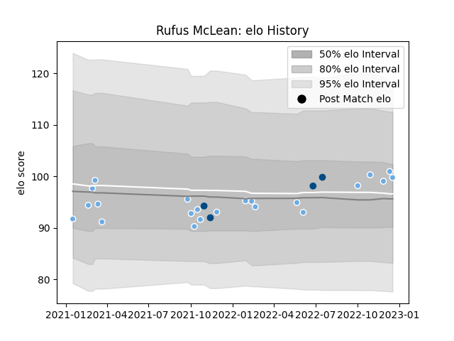

---  
layout: page  
title: Rufus McLean  
date: 2022-12-14 11:31:01.965755  
categories: player  
---
# Rufus McLean

## Positions: W

## Country: Scotland

## Current elo: 101.0

## Current Percentile: 64.0

# Elo History

# Match History

| Team             |   Appearances |   Win Rate |
|:-----------------|--------------:|-----------:|
| Glasgow Warriors |            21 |    0.52381 |
| Scotland         |             4 |    0.5     |

| Opponent         |   Matches |   Win Rate |
|:-----------------|----------:|-----------:|
| Leinster         |         4 |   0        |
| Benetton Treviso |         3 |   0.666667 |
| Edinburgh        |         2 |   0.5      |
| Ospreys          |         2 |   0.5      |
| Ulster           |         2 |   0        |
| Zebre            |         2 |   1        |
| Argentina        |         1 |   0        |
| Bath Rugby       |         1 |   1        |
| Chile            |         1 |   1        |
| Connacht         |         1 |   1        |
| Dragons          |         1 |   0        |
| Lions            |         1 |   1        |
| Munster          |         1 |   1        |
| Sharks           |         1 |   1        |
| South Africa     |         1 |   0        |
| Tonga            |         1 |   1        |