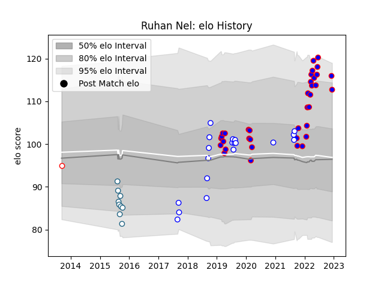

---  
layout: page  
title: Ruhan Nel  
date: 2022-12-18 16:31:10.747101  
categories: player  
---
# Ruhan Nel

## Positions: C, W

## Current elo: 114.0

## Current Percentile: 87.0

# Elo History

# Match History

| Team             |   Appearances |   Win Rate |
|:-----------------|--------------:|-----------:|
| Stormers         |            37 |   0.689189 |
| Western Province |            19 |   0.578947 |
| Griquas          |             9 |   0.111111 |
| Golden Lions     |             1 |   1        |

| Opponent            |   Matches |   Win Rate |
|:--------------------|----------:|-----------:|
| Free State Cheetahs |         5 |      0.4   |
| Natal Sharks        |         5 |      0.4   |
| Bulls               |         5 |      0.8   |
| Golden Lions        |         5 |      0.4   |
| Pumas               |         4 |      0.75  |
| Lions               |         4 |      0.75  |
| Sharks              |         4 |      0.625 |
| Blue Bulls          |         4 |      0.5   |
| Griquas             |         4 |      0.5   |
| Hurricanes          |         2 |      0.5   |
| Jaguares            |         2 |      1     |
| Dragons             |         2 |      1     |
| Ulster              |         2 |      1     |
| Western Province    |         2 |      0     |
| Ospreys             |         1 |      1     |
| Melbourne Rebels    |         1 |      1     |
| Queensland Reds     |         1 |      0     |
| Scarlets            |         1 |      1     |
| Munster             |         1 |      0     |
| Benetton Treviso    |         1 |      0     |
| London Irish        |         1 |      1     |
| Leinster            |         1 |      1     |
| Glasgow Warriors    |         1 |      1     |
| Edinburgh           |         1 |      1     |
| Connacht            |         1 |      0     |
| Clermont Auvergne   |         1 |      0     |
| Cardiff Blues       |         1 |      1     |
| Brumbies            |         1 |      0     |
| Blues               |         1 |      0     |
| Zebre               |         1 |      1     |